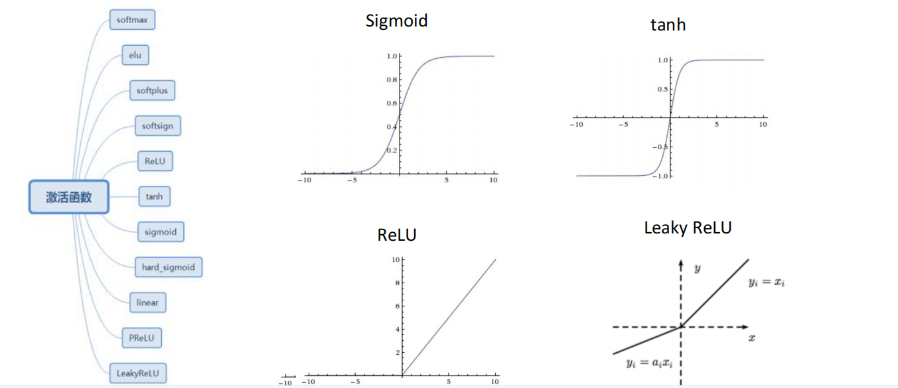
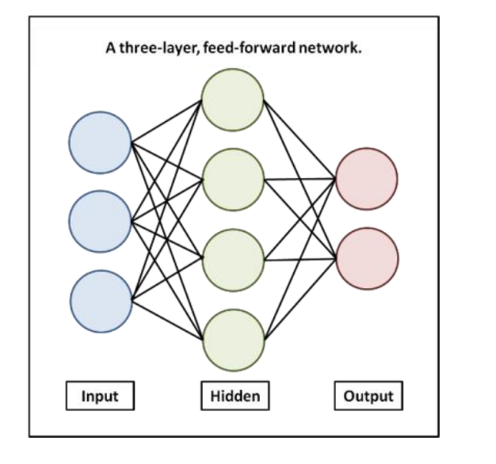

### GAN

#### 1.GAN背景

Generative:生成式模型

Adversarial:采取对抗的策略

Networks:网络

假设我们有两个网络，G（Generator）和D（Discriminator）。正如它的名字所暗示的那样，它们的功能分别是：

- G是一个生成图片的网络，它**接收一个随机的噪声z**，通过这个噪声生成图片，记做G(z)。
- D是一个判别网络，判别一张图片是不是“真实的”。它的输入参数是x，x代表一张图片，输出D（x）代表x为真实图片的概率，如果为1，就代表100%是真实的图片，而输出为0，就代表不可能是真实的图片。

在训练过程中，**生成网络G的目标就是尽量生成真实的图片去欺骗判别网络D。而D的目标就是尽量把G生成的图片和真实的图片分别开来。**这样，G和D构成了一个动态的“博弈过程”。最后博弈的结果是什么？**在最理想的状态下，**G可以生成足以“以假乱真”的图片G(z)。对于D来说，**它难以判定G生成的图片究竟是不是真实的，因此D(G(z)) = 0.5**。这样我们的目的就达成了：我们得到了一个生成式的模型G，它可以用来生成图片。

#### 2.神经网络常见层

###### 卷积层

进行特征提取，如下：

输入图像是32×33×3，3是它的深度（即R、G、B），卷积层是一个5×*5*×3的filter(感受野),这里注意：**感受野的深度必须和输入图像的深度相同**。通过一个filter与输入图像的卷积可以得到一个28×28×1的特征图，上图是用了两个filter得到了两个特征图

权值共享原则：给一张输入图片，用一个filter去扫这张图，filter里面的数就叫权重，这张图每个位置就是被同样的filter扫的，所以权重是一样的，也就是共享。

###### 激活函数

如果输入变化很小，导致输出结构发生截然不同的结果，这种情况是我们不希望看到的，**为了模拟更细微的变化**，输入和输出数值不只是0到1，可以是0和1之间的任何数，**激活函数是用来加入非线性因素的**，因为线性模型的表达力不够 

在神经网络中，对于图像，我们主要采用了卷积的方式来处理，也就是**对每个像素点赋予一个权值，这个操作显然就是线性的**。但是对于我们样本来说，不一定是线性可分的，为了解决这个问题，我们可以进行线性变化，或者我们引入非线性因素，解决线性模型所不能解决的问题。 

因为神经网络的数学基础是处处可微的，所以选取的激活函数要能保证数据输入与输出也是可微的，运算特征是不断进行循环计算，所以在每代循环过程中，每个神经元的值也是在不断变化的。 

这就导致了**tanh特征相差明显时的效果会很好**，在循环过程中会不断扩大特征效果显示出来，但有是，**在特征相差比较复杂或是相差不是特别大时，需要更细微的分类判断的时候，sigmoid效果就好了**。 

**构建稀疏矩阵，也就是稀疏性，这个特性可以去除数据中的冗余，最大可能保留数据的特征**，也就是大多数为0的稀疏矩阵来表示。其实这个特性主要是对于Relu，它就是取的max(0,x)，因为神经网络是不断反复计算，实际上变成了它在尝试不断试探如何用一个大多数为0的矩阵来尝试表达数据特征，结果因为稀疏特性的存在，反而这种方法变得运算得又快效果又好了。所以我们可以看到**目前大部分的卷积神经网络中，基本上都是采用了ReLU 函数**。

###### 池化层

对输入的特征图进行压缩，一方面使特征图变小，简化网络计算复杂度；一方面进行特征压缩，提取主要特征

池化操作一般有两种，一种是Avy Pooling,一种是max Pooling

我们经常会碰到池化操作，而**池化层往往在卷积层后面**，通过池化来降低卷积层输出的特征向量，同时改善结果（不易出现过拟合）。

###### 全连接层

连接所有的特征，将输出值送给分类器

