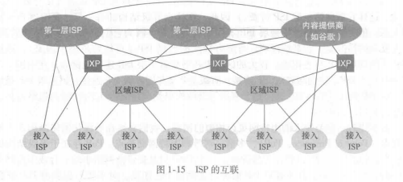

### 第一章 计算机网络和因特网

#### 1.什么是因特网

##### 用具体构成描述因特网

电脑，服务器，手机，智能电器等设备都称为主机或端系统

端系统通过通信链路和分组交换机连接到一起。

不同类型的通信链路由不同类型的物理媒体组成，不同链路能以不同速率传输数据。一台端系统向另一台端系统发送数据时，发送端系统将数据分段，并为每段加上首部字节，称为分组。这些分组通过网络发送到目的端系统，在那里被装配成初始数据。

分组交换机从它的一条入通信链路接受到达的分组，并从它的一条出通信链路转发该分组。最著名的两种类型是路由器和链路层交换机，朝着最终目的地转发分组。链路层通常接入网中，路由器通常用于网络核心中。

从发送端到接收端，一个分组经历的一系列通信链路和分组交换机称为通过该网络的路径。

端系统通过ISP接入因特网，每个ISP本身就是一个由多台分组交换机和多段通信链路组成的网络。各ISP为端系统提供不同类型的网络接入，也为内容提供者他土工屯特网接入服务。

因特网是将端系统彼此互联，因此为端系统提供接入的ISP也必须互联。较底层的ISP通过国家的，国际的较高层ISP互联起来。

端系统，分组交换机和其他因特网部件都要运行一系列协议，其控制了因特网中信息的接收和发送。TCP传输控制协议，IP网络协议是最为重要的两个协议。IP定义了路由器和端系统之间发送和接收的分组格式。

IETF：因特网标准

##### 从为应用程序提供服务的基础设施的角度描述互联网

涉及多个互相交换数据的端系统的应用程序称为分布式应用程序。

与因特网相连的端系统提供了一个套接字接口，规定了在一个端系统上的程序请求因特网基础设施想运行在另一个端系统上特定目的地程序交付数据的方式。

##### 什么是协议（protocol）

在因特网中，涉及两个或多个远程通信实体的所有活动都受协议的制约。不同的协议完成不同的通信任务。

#### 2.网络边缘

由于位于因特网的边缘，这些设备被称为端系统，也被称为主机。主机分为客户和服务器。

##### 接入网

指将端系统物理连接到其边缘路由器的网络。

边缘路由器是端系统到任何其他远程端系统的路径上的第一台路由器。

宽带住宅接入的两种最流行的类型：数字用户线（DSL）和电缆。

**DSL(Digital Subscribe Line)数字用户线**
这是一种宽带住宅接入的方法，它的ISP是本地电话公司。其使用的通信链路的物理材质为电话线，是一种双绞线。

用户使用DSL调制解调器通过电话线与ISP中的数字用户线接入复用器（DSLAM）来交换数据；家庭DSL调制解调器将数字数据转换为高频音后通过电话线传输到ISP中心，并且通过DSL解调器将DSLAM发送过来的模拟信号转为数字信号；来自许多家庭的模拟信号在DSLAM处被转换为数字形式

在用户一侧，一个分配器把到达家庭的数据信号和电话信号分隔开，并把数据信号转发给DSL调制解调器。电话公司一侧，DSLAM把数据信号和电话信号分隔开，并将数据送往因特网。

**CIC(Cable Internet Access)电缆因特网接入**

这是另一种宽带住宅接入方法，它的ISP是有线电视公司。其使用的通信链路的物理材质有光纤和同轴电缆，也被称为混合光纤同轴（Hybrid Fiber Coax HFC）；

用户使用电缆调制解调器通过同轴电缆与光纤结点相连，光纤结点通过光缆与电缆头端相连，而电缆头端接入了因特网。在电缆头端，电缆调制解调器端接系统（Cable Modem Termination System）起到DSLAM的作用，即实现模拟信号和数字信号的转换；

电缆因特网接入的一个重要特征是共享广播媒体。由头端发送的每个分组向下行经每段链路到每个家庭，每个家庭发送的每个分组经上行信道向头部传输。

**FTTH(Fiber TO The Home)光纤到户**

这里主要是指使用光纤作为通信链路的材质，有两种竞争性的光纤分布方案，一种是主动光纤网络（Active Optical Network），另一种是被动光纤网络(Passive Optical Network).其主要区别在于，是否在传输数据时共享光纤。

**企业（和家庭）接入：以太网和WIFI**

以太网接入是一种在公司、大学、家庭里很流行的接入方式；用户使用双绞线与以太网交换机相连，从而接入因特网；接入以太网交换机的速度可达100Mbps;

在无线局域网中，无线用户从一个接入点发送和接收数据，而该接入点与企业网相连，企业网最终接入因特网；在无线LAN中，用户需要在一个接入点的几十米范围之内；

**广域无线接入：3G和LTE**

在移动设备中，通过蜂窝网提供商运营的基站来发送和接收组，与WIFI不同的是，用户仅需要位于基站的数万米范围之内即可；

##### 物理媒体

传输媒体是构成通信链路的主要部分，物理媒体通常可以分为导引性媒体和非导引性媒体；其中导引性媒体，信号沿着固体前行；而非导引性媒体中，信号沿着固体媒体前行。

- 双绞线

最便宜的引导性传输媒体，由两条相互螺旋缠绕的铜线组成。目前局域网中的双绞线数据传输速率在10Mbps到10Gbps之间，所能达到的数据传输速率取决于线的粗细以及传输距离；双绞线实际上已经成为高速局域网联网的主要方式；因为现代的双绞线技术速率和传输距离都是很不错的；

- 同轴电缆

也由两个铜导体构成，但是它们是同心的，而非并行的；借助特殊的结构和绝缘层，同轴电缆可得到较高的数据传输速率；在电视系统中应用广泛；同轴电缆可被用作引导性的共享媒体；

- 光纤

一种可以引导光脉冲的媒体

- 陆地无线电信道

无线电信道承载电磁频谱中的信号，不需要物理线路，提供与移动用户的连接以及长距离承载信号的方式；是一种有吸引力的媒体；

- 卫星无线电信道

通过卫星连接两个或多个在地球上的微波发射方（也被称为地面站），该卫星在一个频段上接收信号，在另一个频段上发送信号；种类有同步卫星和近地轨道卫星；

#### 3.网络核心

网络核心即由互联因特网端系统的分组交换机和链路构成的网状网络。

通过网络链路和交换机移动数据有两种基本方法：电路交换和分组交换。

##### 分组交换

在各种网络应用中，端系统彼此交换报文。

为了从源端系统向目的端系统发送一个报文，源将长报文划分为较小的数据块，称之为分组。

在源和目的地之间，每个分组都通过通信链路和分组交换机传送。

交换机主要有两类：路由器和链路层交换机。

分组在通信链路上以等于该链路的最大传输速率传输通过通信链路。因此如果某条链路的最大传输速率为R，分组长度为L，则该链路传输该分组的时间为L/R。

- 存储转发传输

  大多数分组交换机采用存储转发机制来转发分组；所谓存储转发是指交换机在收到一个完整的分组，才会向链路输出转发分组，否则就将收到的部分分组缓存起来；因为缓存等待一个分组的全部数据而导致的时间开销被称为存储转发时延。

- 排队时延和分组丢失

  因为需要缓存分组，所以此时分组交换机需要一个输出缓存（输出队列）；缓冲队列的空间有限性就有可能导致分组交换机无法继续缓存分组（因为链路被占用或者分组还没全部到位）而使到达分组交换机的数据包被迫丢弃，出现分组丢失的情况；这就导致了分组不但承担了传输时延，还承担了排队时延。

  

- 转发表和路由选择协议

  实际上，分组交换机之所以能够知道往哪去是因为其内部有一个**转发表**，这个表维护了一个IP地址和链路的对应关系，所以处理流程为：

  1. 通过分组的必要信息，获得目的端系统的IP地址
  2. 通过IP地址索引转发表，从而确定输出链路

​       因特网有一些特殊的路由选择协议，用于自动设置这些转发表

##### 电路交换

在电路交换网络中，在端系统通信会话期间，交换机会预留端系统间通信路径上的相关资源（缓存，链路传输速率），即先建立连接，然后通信；而在分组交换网络中，这些资源没有被预留；也就是说，在端系统进行通信时，其所需要的资源是被保持的，其他通信是无法使用这一部分资源的；也就说，端系统间真正建立了一条“连接”；而这一连接，用电话的术语被称为“电路”。传统的电话网络就是电路交换网络的例子。

电路交换网络中的复用

频分复用（FDM）：将频率域划分为频段，然后将频段分配给连接；此频段被用来专门传输链接的数据。该频段的宽度成为带宽。

时分复用（TDM）：是指将时间划分为固定区间的帧，每个帧则又被划分为固定数量的时间空隙；当网络需要建立一条连接时，网络将在每个帧中为该连接指定一个时隙；在该时隙内，链路用来传输该链接的数据。

##### 分组交换与电路交换对比

分组交换的优点：它提供了比电路交换更好的带宽共享；它比电路交换更简单、更有效、实现成本更低；

分组交换的缺点：分组交换不适合实时服务，因为端到端的时延是可变、不可预测的，这和整个网络的情况相关；

电路交换的优点：提供了端对端传输数据的速率保证；

电路交换的缺点：电路交换存在静默期，这是指专用电路空闲时，其占用的资源并没有得到充分的利用；
建立连接的过程比较复杂；

总体上来说，分组交换的性能要好于电路交换的性能，但是不同类型的分组交换方式有不同的应用场景；比如一些对最低速率有着严格要求的应用，比如实时服务等，为了获得速率保证，牺牲网络的效率也是可以接受的。趋势向着分组交换发展。

##### 网络的网络

因特网是一个庞大而复杂的系统，但是我们需要一个模型来刻画因特网的结构；该用什么样的结构来刻画因特网呢？我想，最普遍的说法就是：因特网是网络的网络。但是这一说法足够精炼的同时也不够明确。更重要的是，我们可以选择更明确的方法来刻画因特网；书中通过5个模型不断过渡到最终模型，其实过渡的过程就结构不断合理、连接方式不断明确的过程。

我们在什么是因特网 一节中介绍ISP，端系统是通过ISP接入因特网的，为了实现端系统的互联，ISP也必须互联，其实网络模型就是用来表达ISP和端系统以及ISP之间的结构的抽象；

网络结构1：存在唯一的全球承载ISP互联所有的接入ISP，这是指，全球ISP是一个又路由器和通信链路构成的网络，该网络跨越全球，并且其他的接入ISP都至少和一个它的路由器相连；

网络结构2：存在多个全球承载ISP，它们分别于一部分的接入ISP互联；为了实现端系统的互联，这多个全球ISP也必须互联；网络结构是一个两层结构，其中全球承载ISP位于顶层，接入ISP处于底层；

网络结构3：顶层全球承载ISP基本上已经定型，但是接入ISP现在还很混乱，比如，它们直接同顶层ISP相连；而网络结构3中，接入ISP也是分层的：较小区域中的ISP连入较大区域的ISP，而不是直接与顶层ISP相连；为什么会出现这样的结构呢？这是因为，如果都直接同顶层ISP相连，那么两个同一较小区域内，分属不同ISP的端系统之间通信的数据也会到顶层ISP中心去一趟，如果它们不是直接接入顶层ISP，而是接入了一个较大区域的ISP，那么它们之间的通信数据就不用去顶层ISP中心了，因为它们通过较大区域的ISP已经实现了互连，所以通信速度肯定就上去了。

网络结构4：是在网络结构3的基础上，增加了以下特点而形成的结构：存在点（Point of Presence，PoP）、多宿、对等、因特网交换点（Internet exchange point，IXP）。PoP存在于等级结构中所有层次，但是底层ISP除外；一个PoP是ISP网络中的一台或者多台路由器群组，其中客户ISP能够通过第三方提供的高速链路直接将它的路由器和供应商的PoP连接，从而实现与提供商ISP连接。这样接入速度很明显就提高了。
多宿（multi-home）是指，任何ISP（除第一层ISP）都可以与两个或者多个提供商ISP连接，这被称为多宿；这样网络的可靠性就提高了
对等（peer） 是指，位于相同等级结构层次的一对邻近ISP能够直接将它们的网络连接到一起，使它们之间流量经直接连接而不是经过上游的中间ISP传输，这样既不用付费，速度也可能会快一些；因特网交换点是为了实现多个ISP可以对等而创建的。

网络结构5：网络结构5是在网络结构4的基础上增加了内容提供商网络而构成。内容提供商构建自己的网络，并且通过与较低层ISP对等而“绕过”较高层因特网ISP，而且内容提供商对端用户也有了更多的控制。

总体来说，今天的因特网是一个“网络的网络”，其结构复杂，由十多个顶层ISP和数十万个较低层ISP构成。近年来，主要的内容提供商创建自己的网络，直接在可能的地方与较低层ISP互联。

#### 4.分组交换网中的时延、丢包和吞吐量

##### 时延

一个分组在沿途每个节点承受不同类型的时延，这些时延中最为重要的是：结点处理时延、排队时延、传输时延和传播时延.这些时延总体累加起来是结点总时延。

- 处理时延

  检查分组首部和决定该分组导向何处所需要的时间是处理时延的一部分。通常在微秒或者更低数量级。在这之后，路由器将该分组引向通往路由器b链路之前的队列。

- 排队时延

  排队时延是因为分组所对应的出链路前面有其他分组正在传输，所以分组需要该链路的缓冲队列里等待其他分组传输完毕而产生的；一般来说，排队时延是到达该队列的流量强度和性质的函数，通常可以达到毫秒级到微秒级。

- 传输时延

  当且仅当所有已经到达的分组被传输后，才能传输刚到达的分组。传输时延是将所有分组的比特推向链路所有需要的时间，实际的传输时延通常在毫秒到微秒数量级。用L表示分组的长度，用Rbps表示从路由器A到B的链路传输速率。传输时延是L/R。

- 传播时延

  传播时延是指比特进入链路后，从该链路的起点到下一个结点所用的时间；一旦分组中的最后一个比特到达路由器就意味着该分组的所有比特都已到达路由器；广域网中，传播时延一般是毫秒级的。传播时延是d/s。d是路由器A到B的距离。s是链路的传播速率。

- 传输时延和传播时延的比较

  传输时延就是大卡车经过收费站的时间而传播时间就是车在高速公路上行驶的时间。传输时延是分组长度和链路传输速率的函数。传播时延是两台路由器间距离的函数。

##### 排队时延和丢包

丢包：到达的分组发现一个满的队列。由于没有地方存储这个分组，路由器将丢弃该分组，该分组将会丢失。

排队时延和丢包与网络的状况和结点的缓冲空间大小、处理速度相关；如果分组到达的速度高于结点的处理速度，那么分组就会在缓冲队列里排队等待。当缓冲空间用完后，如果还有到的分组，那么该分组将被迫丢弃。

为了描述网络状体，我们引入了流量强度这一概念：**流量强度=分组到达的速度/结点的处理速度**；流量工程里一个金科玉律就是：设计系统时流量强度不能大于1；

流量强度接近0，几乎没有排队延迟，接近1时，排队延迟很大。当流量强度持续大于1时，就将出现丢包现象。

丢包的结果：可能被之前的结点重传，也可能由源重传，也可能直接丢弃。

##### 端到端时延

Traceroute:当分组向着目的地传送，它们通过一系列路由器。当路由器接收到这些分组之一，向源回送一个短报文。短报文包括路由器的名字和地址。

##### 吞吐量

计算机网络的吞吐量实际上是一个速度指标，它描述了比特经过某个节点的速度。对于某条路径上的结点来说，和该结点有关的速度有两个：接收数据的速度和发送数据的速度，而该结点的吞吐量是这两个速度中较小的一个；对于某条路径来说，该路径的吞吐量则是所有节点的吞吐量的最小值；网络的吞吐量可以衡量网络的性能.

任何时间的瞬时吞吐量是主机B接受到该文件的速率

如果该文件由F比特组成，主机B接受到所有比特用去Ts，则文件的平均吞吐量为F/Tbps

Rs表示服务器与路由器之间的链路速率，Rc表示路由器与客户之间的链路速率。如果Rs小于Rc，则服务器注入的比特顺畅的通过路由器，若大于，则路由器不能像接收速率那样快的转发比特。

吞吐量可以近似为源和目的地之间路径的最小传输速率。（min{Rc，Rs}）最小传输速率的链路为瓶颈链路。

在今天，因特网对吞吐率的限制因素通常是接入网。

####  5.协议层次及其服务模型

##### 协议分层

计算机网络采用分层的体系结构，分层的体系结构因为提供模块化而具有很高的价值，模块化使更新系统组件更为容易，同时也易于服务实现的多样性：**某一层对其上一层提供服务，同时它可以利用下一层提供的服务。**只要对上提供的服务和对下利用的服务没有变化，其层内部的实现并不会对系统结构产生影响；对于大而复杂且需要不断更新的系统来说，改变服务的实现而不影响系统其他组件是分层模式的另一个重要优点。分层一个潜在的确定是一层可能冗余较低层的功能。另一个是某层的功能可能需要仅在其它层才出现的信息，违反了层次分离的目标。

总体来说，将各层的所有协议组合起来，称为**协议栈**。因特网的协议栈有5个层次组成**：物理层、链路层、网络成、传输层、应用层**

- 应用层

  应用层协议分布在多个端系统，端系统中的应用程序使用该协议与另一个端系统中的应用程序通信。处于应用层的分组称为**报文**（message）。

  HTTP：提供了web文档的请求和传送

  SMTP：提供了电子邮件报文的传送

  FTP：提供了两个端系统之间的文件传送

- 传输层

  在应用程序端点之间传送应用层报文。

  因特网中有两个传输层协议：TCP和UDP。处于传输层的分组称为**报文段**（segment）。TCP提供确保传递、流量控制、拥塞控制机制。向它的应用程序提供面向连接的服务。UDP提供无连接服务，即不提供不必要服务的服务。没有可靠性、没有流量和拥塞控制。

- 网络层

  网络层将称为**数据报**（datagram）的网络层分组从一台主机移动到另一台主机。网络层协议包含著名的IP协议以及其他一些路由选择协议。

- 链路层

  链路层将称为**帧**（frame）的链路层分组从一个结点移动到路径上的下一个节点。一个帧可能被沿途不同链路上的不同链路层协议处理。

- 物理层

  物理层的任务是将帧中的**比特**（bit）从一个结点移动到下一个节点，它提供了传输信息的实际物理通道。

  

OSI模型：

在因特网协议栈出现以前，OSI模型是ISO组织研发的计算机网络结构模型。OSI的模型一共有7层，从下到上依次为：物理层，链路层，网络层，传输层，**会话层，表示层**，应用层。相比因特网体系结构，OSI多了两层。

因特网将两层的功能留给了开发者自行实现。

##### 封装

一个分组，在不同的层次有不同的称谓，是因为它们经过每一层的时候就被该层封装上了属于该层的相关信息，也就是前面提到的必要信息；于是，每一分层的分组有两种类型的字段：首部字段和有效负载；其中有效负载即为来自上一层的分组数据，而首部字段就是该层加上的必要信息；分组不断被封装以实现各层协议规定的相关功能。

#### 6.面对攻击的网络

病毒：一种需要某种形式的用户交互来感染用户设备的恶意软件。

蠕虫：一种无须任何明显用户交互就能进入设备的恶意软件。

### 第二章 应用层

#### 1.应用层协议原理

研发网络应用的核心是写出能够运行在不同端系统和通过网络彼此通信的程序；值得注意的是，我们不需要写在网络核心设备如路由器或者链路层交换机上运行的软件，这种设计方式即将应用程序限制在端系统的方法，促进了大量网络应用程序的迅速研发和部署。

##### 网络应用程序体系结构

应用程序的体系结构不同于网络的体系结构。从应用程序研发者的角度来看，网络体系结构是固定的，并为应用程序提供特定的服务集合；换言之，应用程序体系结构使用应用程序开发设计的，它规定了在端系统上如何组织应用程序。两种常见的现代网络应用程序所采用的体系结构为：**客户-服务器体系结构和对等体系结构**。

**客户-服务器体系结构**
在该体系结构中，有一个总是打开的主机，即服务器，它接收和服务来自其他许多被称为客户的主机请求；**值得注意的是，在该体系结构中，客户之间是不直接通信的**；**该服务器具有固定的、周知的地址。**由于服务器总是开着的，且具有固定、周知的地址，客户总是能通过向该服务器的IP地址发送分组来与其联系。

客户-服务器体系结构的著名应用有：Web、FTP、Telnet和电子邮件。

通常，如果仅有一台服务器处理所有的请求，那么服务器系统将很快变得不堪重负，为此，配备大量主机的数据中心常被用于创建强大的虚拟的服务器，一个数据中心可以有数十万台服务器，它们需要供电和维护，同时服务提供商还需要支付不断出现的互联和带宽费用，以及发送和接收到达/来自数据中心的数据；

**P2P体系结构**
在P2P体系结构中，对位于数据中心的专用服务器有着最小（或者没有）依赖。应用程序在间断连接的主机对之间使用直接通信，这些主机被称为对等方。对等方并不为服务提供商所拥有，因为这种对等方通信不需要通过专门的服务器，所以该体系结构也被称为对等方到对等方结构

目前，流量密集型应用都是P2P体系结构的。这些应用包括文件共享（例如BitTorrent）、协助下载（例如迅雷）、因特网电话（例如Skype）和IPTV(例如迅雷看看)。

值得注意的是，某些应用具有混合的体系结构，它们结合了客户-服务器和P2P这两种体系结果，比如许多的即时通讯工具，服务器用来跟踪用户IP地址，但是用户之间的通信则使用直接发送

P2P体系结构最引人入胜的特性之一就是它们的**自扩展性**。比如在文件共享应用中，对等方可能通过向文件的原始拥有者发出请求而产生工作量，但是对等方也有可能通过为其他对等方传送文件而为原始拥有者分担压力；P2P体系结构也是成本有效的，因为他通常不需要庞大的服务器基础设施和服务带宽。

但是P2P也面临着以下三个问题：

ISP友好。大多数住宅ISP受制于非对称带宽应用，也就是下载比上传要多得多。但是P2P视频和文件分发应用改变了从服务器到住宅ISP的上载流量，因而给ISP带来压力；安全性。因为其高度的分布和开放式，P2P应用也可能给安全带来挑战；激励。如何说服用户资源向应用提供带宽、存储和计算资源？这是一个问题；

##### 进程通信

在操作系统中，**实际进行通信的是进程而不是应用程序**；当进程运行在同一个端系统上时，它们使用进程间通信机制相互通信；而进程间通信的规则是由端系统上的操作系统确定的。当进程运行在不同的端系统上时，它们通过跨越计算机网络的报文相互通信；发送进程产生报文并且向网络中发送，接收进程接收报文并对此作出响应（不响应也是一种响应）。

**1.客户和服务器进程**

对于没对通信进程，我们通常将这两个进程之一标识为客户，而另一个进程标识为服务器。

需要注意的是，在某些P2P应用中，一个进程可能既是客户也是服务器，因为在一个文件共享应用中，一个进程的确既能请求文件也能发送文件。所以从进程所扮演的角色来区分是客户进程还是服务器进程不够精确，所以我们从发起通信的顺序来定义它们：在给定的一对进城之间，**首先发起通信的进程被标记为客户进程，在会话开始时等待联系的进程被称为服务器进程**。

**2.进程与计算机之间的接口**

多数应用程序是由通信进程对组成的，运行在不同端系统上的进程对之间通过计算机网络来实现通信。所以，在应用程序进程和计算机网络之间存在一个接口，该接口被称为套接字（socket）。更为准确的说，套接字是同一台主机内应用层和运输层之间的接口。由于该套接字是建立网络应用程序的可编程接口，因此套接字也被称为应用程序和网络之间的应用编程接口（Application Programming Interface）.

**3.进程寻址**

为了向特定目的进程发送报文，发送机进程需要知道接收进程（更为准确的说是，接收进程对应的套接字）的标记。该标记由两部分组成：**接收进程所在的主机地址和接收进程在该主机中的标记**；在因特网中，**主机由IP地址标记**，其中IP地址是一个32位（IPV4）标记；而**接收进程（或者说是其对应的套接字）使用端口号标记**；一些常用的应用程序有着固定的端口号，比如Web服务器使用80端口、邮件服务器（运行SMTP协议）使用25端口等

##### 可供应用程序使用的运输服务

传输层协议的特点大致可以从以下这四个方面考量：可靠数据传输、吞吐量、定时和安全性

1.可靠数据传输

如同在第一章中介绍的，分组在传输过程中可能会丢失。比如，分组因为路由器中的缓存溢出而被丢弃或者分组在传输的过程中发生了损坏等情况；有些应用是不允许数据发生丢失的，比如电子邮件、文件传输、远程主机访问、Web文档传输以及金融应用等。为了支持这些应用，必须做一些工作以确保应用程序一段发送的数据正确、完全地交付给接收数据的进程。**如果一个协议提供了这样得确保数据交付的服务，就认为该协提供了可靠数据传输**。当应用程序使用可靠数据传输的传输层协议时，只要将要发送的数据传输进套接字就可以完全相信该数据可以完整无差错地到达接收方；

当一个运输层协议不提供可靠数据传输时，由发送方发送的数据就可能不能够到达接收进程。有些应用是允许这样的情况发生的，这些应用被称为丢失允许的应用。这类应用常见的有：交谈式音频和视频。它们能够**承担丢失一定量的数据损失**，在这些应用中，如果丢失少量数据将出现小干扰，但是不会出现致命的损伤，这些应用为容忍丢失的应用。

2.吞吐量

在一条网络路径上的两个进程之间的通信会话中，可用**吞吐量就是指能够向接收进程交付比特的速率**。因为会有其他会话共享该网络的路径的带宽，并且因为这些会话的到来和离开，可用吞吐量将发生变化；这就导致另一种自然的服务，即运输层协议能够提供确切的可用吞吐量。使用这种服务时，应用程序就能以明确的速度接收数据，并且运输层应当保证可用吞吐量必须总是至少为该速度；

**对吞吐量有明确要求的应用程序被称为带宽敏感的应用（bandwidth-sensitive application）**。许多多媒体应用是带宽敏感的（尽管某些多媒体应用程序可能采用自适应编码技术对数字视频和音频以与当前可用带宽相匹配的速度加解码。），比如因特网电话。而**弹性应用（elastic application）则对吞吐量没有严格的要求**。这类应用包括：电子邮件、文件传输以及web传送等。值得注意的是，吞吐量当然是越多越好了。

3.定时

运输层协议也能提供定时保证。定时和吞吐量都是关于速度的。一个提供定时服务的例子是：发送方注入套接字中的每个比特到达接收方的套接字不迟于100ms。也就是说，**定时是对数据从发送到到达所需时间的要求**，而**吞吐量是对数据交付速度的要求**。打个比方，吞吐量是指一个小时内经过某个收费站的汽车数目，而定时则是第一辆车从出发到进入收费站的时间。有些应用为了服务的有效性而对数据到达时间有严格的要求，常见的应用有：因特网电话、多方在线游戏等；

4.安全性

运输层可以提供一些安全服务，以防止传输的数据以某种方式在这两个进程之间被察觉到。这些安全服务包括：数据的加解密、数据的完整性和端点鉴别等。

##### 因特网提供的运输服务

1.TCP服务

TCP服务模型包括了**面向连接的服务和可靠数据传输服务**。

面向连接的服务：在应用层数据报文开始流动之前，T**CP会让客户端和服务器端相互交换传输层控制信息**。这个握手过程将提示客户端和服务器端，让它们为即将到来的大量分组做好准备；**握手阶段接收后将建立一个TCP连接**。这条链接是全双工的，即连接双方使用该条链接可以同时进行报文的收发。这条连接将在通讯结束后拆除；
可靠的数据传输：应用程序使用TCP协议可实现无差错、按适当顺序交付所有发送的数据，没有字节的丢失和冗余；

TCP服务还提供了拥塞控制机制。该机制不一定会给通行双方带来好处，但是会给网络带来整体好处；当发送方和接收方之间的网络出现拥塞时，TCP将使用拥塞控制机制来使网络恢复正常。

TCP安全：TCP和UDP没有任何加密机制，这就是说发送进程传进其套接字的数据，与经网络传送到目的数据的数据相同。因此因特网界研制了TCP的加强版，安全套接字层（Secure Sockets Layer，SSL）。SSL提供了进程到进程的安全性服务。

2.UDP服务

UDP服务是一种不提供不必要服务的**轻量级运输协议**。它仅提供**最小服务**。UDP是无连接的也就是说**通信之前没有握手**；UDP不提供数据的可靠传输；UDP也没有拥塞控制机制，所以UDP的发送端可以用它选定的任何速率向其下层（网络层）注入数据。有些应用场景下，UDP协议将带来更多的便利和效率，比如DNS和一些因特网电话服务（为了避免拥塞控制协议的控制而使用UDP）

3.传输层无法提供的服务

从可靠数据传输、吞吐量、定时、安全性等四个角度来看运输层提供的服务，我们发现，运输层无法对吞吐量和定时做出保证。但是，今天的因特网能够为时间敏感的应用提供满意的服务，尽管它并不提供任何定时或者带宽保证；

##### 应用层协议

**应用层协议定义运行在不同端系统上的应用程序进程如何相互传递信息**。涉及的内容包括：交换的报文类型（请求或者响应）、报文中包含哪些字段、字段如何被解释、一个进程何时收发报文并如何对报文进行响应等内容。**应用层协议是网络应用的一部分。**

#### 2. Web和HTTP

##### HTTP概况

超文本传输协议HTTP（HyperText Transfer Protocol）是WEB的应用层协议，它是Web的核心；HTTP有两部分实现，一个客户端程序一个服务器程序；客户和服务器程序运行在不同的端系统中，通过交换HTTP报文进行会话。HTTP定义了客户和服务器进行报文交换的方法；

**Web页面是由对象组成的**，一个对象是一个文件，它们通过一个URL地址进行寻址。客户和服务器交互的核心思想是**客户通过HTTP请求对服务器发出对Web页面的请求报文，服务器收到该报文后将返回包含该对象的HTTP响应报文**。URL地址由两部分组成：存放对象的服务器主机名和对象的路径名。web浏览器实现了HTTP的客户端，web服务器实现了HTTP的服务器端。

HTTP使用TCP作为它的传输层协议；**HTTP客户首先发起一个与服务器的TCP连接，需要注意的是，服务器根据请求作出响应，但是不存储任何关于该客户的状态信息**；也正因为这样，HTTP被称为**无状态协议**。同时，Web使用了客户端-服务器的应用体系结构；其中web服务器总是开着的，具有一个固定ip地址，且服务于可能来自数以百万计的不同浏览器的请求。

##### 非持续连接和持续连接

在因特网应用程序中，**客户端和服务器将在很长的时间范围里通信**；应用程序将根据自身的特点，选择以规则的间隔周期性性发出请求也可以间断性一个个发出请求。当通信是使用TCP协议时，服务器端需要做出一个决定：这些请求是使用一个TCP连接完成还是通过独立的TCP连接完成。如果采取前一个方法，则称应用程序使用持续连接，如果使用后一种方式，则称为非持续连接。

**采用非持续连接的HTTP**

使用非持续连接时，每个TCP连接在服务器发送一个对象后就会关闭，也就是每个TCP只传送一个请求报文和响应报文；

为了描述持续连接和非持续连接的特点，我们引入往返时间RTT(Round-Trip Time)。**RTT指的是，一个短分组从客户端到服务器，然后再返回客户端所用的时间**。RTT包括分组的传播时延、排队时延、处理时延（因为是短分组，所以其传输时延可不计）；因为客户端和服务器建立TCP连接的时候，会通过一个三次握手的过程来交换传输控制信息。三次握手的前两次占用了一个RTT，客户结合第三次握手通行会通过该连接发送一个HTTP请求报文，一旦该分组到达服务器，服务器便开始使用TCP传输HTML对象。因此，粗略地说，响应时间是两个RTT加上传输HTML的时间（不是传播）。

**采用持续连接的HTTP**

非持续连接必须为每个请求新建一个TCP连接，而每个TCP连接将占用系统资源，包括缓冲区和变量等，这样服务器的负担就很重了。一个对象将通过两个RTT的时延才能交付。

如果使用持续连接，那么服务器在发送响应报文后将保持该TCP打开，后续客户端可以使用该连接来向服务器发出请求。不但一个完整的页面可以通过同一个连接传送，同一台服务器上的多个页面也可以通过同一个连接发送。这就提高了效率；

一般来说，如果一条连接在一定的时间间隔后没被使用的话，就会被关闭。HTTP默认使用的是带流水线的持续连接。

##### HTTP报文格式

- 请求报文

一个请求报文具有至少一行的内容。请求报文的第一行称为请求行，其后继的各行被称为首部行。请求行包含三个内容：方法字段、URL字段、HTTP版本；其中方法字段可为：GET、POST、PUT、DELETE、HEAD等。URL字段里可以传递请求对象的标志；

首部行包含是否在发送完响应报文后关闭TCP连接的Connection；请求的主机地址（该头部信息被Web高速缓存所要求）；浏览器版本；可接受的语言等头部信息；

在首部行之后一个空行，之后便是请求的“实体体”。该实体体可以在POST方法里传递Form表单内容或者传递其它一些二进制流数据等。值得注意的是，表单也不一定必须使用POST方法。如果使用get,实体体为空，会显示在url中。

Head类似于get方法，将会用一个http报文进行响应，但是不返回请求对象，经常用作调试跟踪。put方法允许用户上传对象到指定的Web服务器上指定的路径。Delete方法允许用户或应用程序删除Web服务器上的对象。

- 响应报文

  

响应报文总体上也分三个部分，第一部分是状态行，包含HTTP版本、状态以及状态信息等内容；第二部分是首部行，包含发送日期、服务器类型、上一次修改请求资源的时间、内容的类型等内容。第三部分是实体体。实体体包含请求对象本身。

这里的Date是从文件系统中检索到该对象，插入到响应报文，并发送该响应报文的时间。

常见状态码
200：请求成功 处理方式：获得响应的内容，进行处理

301：请求到的资源都会分配一个永久的URL，这样就可以在将来通过该URL来访问此资源 处理方式：重定向到分配的URL

400：非法请求 处理方式：丢弃

404：没有找到 处理方式：丢弃

505：服务器不支持请求报文使用的http版本。

##### 用户和服务器的交互：cookie

前面提到，HTTP是无状态协议，但是Web站点为了识别用户身份或者限制用户访问的时间或者将用户访问的内容同用户身份相关联，Web站点可以使用Cookie技术；

Cookie技术包含4个组件

-  HTTP响应报文里增加一个关于Cookie的首部行；
-  HTTP请求报文里增加一个关于Cookie的首部行；
-  用户端系统保留一个Cookie文件，由浏览器保存维护；
-   Web站点建立Cookie和用户身份的关联；

虽然，Cookie的使用方便了用户也方便了服务端，但是它的使用存在争议，因为使用Cookie被认为是对用户隐私的一种侵犯，因为Web站点可以通过Cookie得到很多用户的信息，并有可能将这部分信息卖给第三方等

##### Web缓存

Web缓存器也被称为代理服务器，**它代表初始web服务器来满足HTTP请求**。它有自己的存储空间，并在存储空间里保持有最近请求过的对象的副本；可以通过配置浏览器，**将所有指向初始服务器的请求首先指向代理服务器。**

当代理服务器收到一个HTTP请求后，它将检查本地是否缓存过该对象，如果缓存过该对象，将检查是否过期，如果没有过期，则直接将该对象返回给浏览器；如果本地不存在或者存在已过期，则代理服务器将根据请求报文里的Host首部行以及请求行里的URL字段向初始服务器发出请求，然后将响应对象返回给浏览器并缓存在本地。

通常，代理服务器与客户端的通信速度要快于初始服务器与客户端的连接速度；Web代理服务器可以大起大减少对客户请求的响应时间；而且，缓存器能从整体上大大降低因特网上的web流量，从而有助于提高所有应用程序的性能；

通过使用内容分发网络（Content Distribution Network），Web缓存器正在因特网中发挥越来越重要的作用

**Web缓存即是客户又是服务器**

##### 条件GET方法

高速缓存器的使用，带来很多好处，但是有一个问题就是代理服务器对缓存对象的管理：如何确保所请求的对象是最新的？其实HTTP提供了一种机制，允许缓存器证实其使用的对象是最新的，这种机制就是条件GET方法。使用条件GET方法只需在使用GET方法的时候，增加一个**If-Modified-Since**首部行，其对应的内容是一个时间，如果所请求的资源在指定日期后被修改了，那么服务器将返回新的对象，否则服务器将返回一个包含空实体体的报文。这样代理服务器就可以确认缓存是否过期了。

#### 3.因特网中的电子邮件

因特网电子邮件系统有三个核心组件：用户代理(user agent)、邮件服务器(mail server)、SMTP（简单邮件传输协议，Simple Mail Transfer Protocol）。

邮件服务器构成了电子邮件系统的核心。每个收发方在邮件服务器上拥有一个邮箱；一个典型的电子邮件发送过成为：发送方通过用户代理将邮件传送到发送方的邮件服务器，然后再传输到接收方的邮件服务器，然后邮件被分发到接收方的邮箱里；接收方从邮件服务器里获取自己的邮件时需要通过邮件服务器的验证

SMTP是因特网中电子邮件的主要应用层协议，它使用**TCP可靠数据传输服务**，从发送方的邮件服务器向接收方的邮件服务器发送邮件；在**每台邮件服务器上同时运行SMTP服务器和SMTP客户端**。当邮件服务器接收其他邮件服务器的邮件时，它表现为SMTP服务器，当邮件服务器向其他邮件服务器发送邮件时，表现为SMTP客户端。

如果发送端不能将邮件发送个接受端的服务器，发送端的邮件服务器会在一个报文队列（message queue）中保持该报文并在以后尝试再次发送。

##### SMTP

传输的三个阶段：握手、传输、关闭连接。

SMTP25号端口。SMTP是持续连接的。对每一报文，客户使用一个新的MAIL 开始。当所有报文发送完后才发送QUIT，断开连接。SMTP出现在因特网之前，尽管它有着很不错的特性，但是它具有的某种陈旧的特征表明它仍然是一种继承的技术，比如，**它限制邮件报文的所有部分只能使用7比特的ASCII表示**，这就导致二进制多媒体文件需要编码为ASCII，而且在发送方需要编码，接收方则需要解码。

值得注意的是，SMTP报文一般不使用中间邮件服务器发送报文，也就是**邮件不会在中间某个邮件服务器保留**；TCP连接建立之后，服务器和客户执行某些应用层的握手。在SMTP握手阶段，SMTP客户端将介绍发送方和接收方的邮箱地址；一旦介绍完毕后，SMTP客户端将开始发送报文

##### 与HTTP对比

HTTP和SMTP都是用TCP协议；都用于从一台主机向另一台主机传送文件：HTTP从Web服务器向Web客户传送文件，SMTP从一个邮件服务器向另一个邮件服务器传送文件。持续的HTTP和SMTP都是用持续连接；但是两者也有区别。

首先HTTP被设计为一个Pull协议（pull protocol）而SMTP被设计为一个Push协议（push protocol）。**即用户通过HTTP主动向服务器请求内容，而SMTP则是客户将内容推向服务器端；**
第二个区别就是HTTP传输的数据不一定是用ASCII字符，但是SMTP则只能使用ASCII字符；
第三个重要区别就是，HTTP将每个对象封装在自己的响应报文里，而SMTP则将所有的报文对象放到一个报文之中；

##### 邮件报文格式

报文由两部分组成：一个包含环境信息的首部和一个包含邮件内容的报文体；首部和报文体之间使用空行分开；首部行的格式为关键字：及其值；每个首部必须包含一个From和To首部行。首部也可以包含其它信息，比如Subject等。这与2.4.1中接触的SMTP命令不同，那节中的命令是握手协议的一部分；本节中研究的内容是邮件报文自身的一部分

##### 邮件访问协议

需要注意的是，SMTP是邮件服务器之间发送邮件报文的协议，并不是用户通过代理和邮件服务器之间通信的协议；用户代理使用邮件访问协议来从邮件服务器上获取邮件信息；目前常用的邮件访问协议有POP3（Post Office Protocol-Version 3）、因特网邮件访问协议（IMAP，Internet Mail Access protocol）和HTTP

- POP3

  POP3是一个非常简单的协议，因为简单，所以功能有限；POP3使用**端口110**来建立TCP连接（SMTP使用端口25）；POP3按照三个阶段进行工作：特许、事务处理和更新；在特许阶段，用户代理发送密码和用户名，进行身份鉴别；第二阶段，用户代理取回报文，同时还可以做删除、取消删除等标记或者统计邮件信息；第三个阶段是在用户退出后，POP3结束会话，删除被标记的邮件；

一个需要注意的是，POP3用户代理可以使用两种事务处理模式：一种是下载并删除，另一种是下载保留；POP3代理发出的命令和其工作模式相关；下载并删除的方法存在的问题是，如果用户在一台设备上查看了邮件（下载了邮件）后，邮件将被删除，那么在其他设备上将无法查看邮件；这给用户带来一定的不便。使用下载保存方式，则用户下载邮件后，邮件还在服务器上。

在用户代理与邮箱服务器之间的POP3会话期间，该POP3服务器保留了一些状态信息，特别是标记了哪些用户报文被标记为删除了。但是POP3服务器并不在POP3绘画过程中携带状态信息，大大简化了POP3的服务。

- IMAP
  POP3协议无法为用户提供邮件分类管理的功能，虽然用户可以通过将邮件下载到本地，然后由用户代理程序做分类管理，但是处理的结果是无法同步到其他查看设备上的。为了解决这一问题，IMAP诞生了。IMAP是一个邮件访问协议，比POP3要复杂的多，当然也就有更多的特色了。

（远程）IMAP将每一份邮件和一个一个文件夹联系起来，当报文第一次到达服务器时，它与收件人的INBOX相关联。收件人可以将邮件移到新创建的文件夹，阅读邮件，删除邮件等。IMAP允许用户在不同文件夹里移动邮件并且查询邮件。值得注意的是，IMAP服务器维护了IMAP会话的用户状态信息，但是POP3并不；IMAP协议还允许用户代理获取报文组件而不是报文整体。

- 基于Web的电子邮件
  这种方式主要是指，用户使用HTTP协议和邮件服务器通信。用户代理就是普通的浏览器，但是，邮件服务器之间还是使用SMTP协议的
  

#### 4.DNS：因特网的目录服务

识别主机的方式：主机名或IP地址

##### DNS提供的服务

首先，在计算机网络里，我们通过IP地址来标记某一时刻网络中唯一的主机。IP地址（IPV4）由4个字节组成，有着严格的层次结果，每个字节使用点号分隔。同时，为了方便记忆，我们也通过为主机提供一个便于记忆的主机名来标志主机，这样主机之间的通信就变得方便了。但是，同时也就引入一个问题：主机名和IP地址的转换问题；因为在信息的发送者一端，通常使用主机名来标识主机，但是在计算机网络里是使用IP地址来标机主机。

计算机网络里有一种应用专门提供这样的服务，它就是**DNS（Domain Name System）域名系统**。DNS是一个由分层的DNS服务器组成的**分布式数据库**和一个使得主机可以查询分布式数据库的**应用层协议**组成；

用户主机上应该运行着DNS客户端。DNS通常被其他应用层协议使用，比如：HTTP、SMTP和FTP等。这些协议在正式工作以前，首先利用DNS提供的服务，将主机名转换为IP地址，可以发现的是，DNS为用户带来方便的同时，也为网络应用带来额外的时延——查询DNS服务器的时延。需要注意的是，缓存作为一种提高性能，特别是查询性能的手段，在DNS中同样适用。

**DNS运行在UDP之上，使用53号端口**

除了提供主机名到IP地址的转换外，DNS还提供以下重要服务：
    主机别名（host aliasing）：虽然，主机名比起IP地址好记多了，但是有时候我们的主机名仍然很长，很不好记忆，所以我们需要为主机名再起一个名字，这就是主机别名，DNS不但提供主机名到IP地址的转换服务，还提供主机名与主机别名的转换；此时主机名被称为规范主机名；**应用程序可以调用DNS来获得主机别名对应的规范主机名以及主机的ip地址。**
    邮件服务器别名（mail server aliasing）：**DNS同样也提供邮件服务器主机名和别名的转换服务**，实际上，公司的邮件服务器和Web服务器可以使用相同的主机别名；MX记录允许一个公司的邮件服务器和Web服务器使用相同的主机名。
    负载分配（load distribution）：DNS也被用在冗余的服务器之间分配负载。每个服务器有着不同的IP地址，但是它们都和同一个主机名相关联，也就是一个IP地址集合同一个规范主机名相联系；当某个DNS服务器收到DNS请求时，该服务器将使用IP地址的整个集合作为响应，但是在每个应答中，循环这些地址的次序。因为客户端通常都是使用IP地址集合的首个元素，所以DNS就在冗余的Web服务器之间分配了负载。同理，多个邮件服务器可以具有相同的别名。

##### DNS工作机理概述

#### 5.P2P文件分发

对总是打开的基础设施服务器没有依赖，成对间歇连接的主机之间相互通信。

有两种典型因特网应用十分适合P2P体系结构，一种是文件分发（BitTorrent)，另一种是大型对等方社区中的数据库；我们将探讨分布式散列表的概念。P2P体系结构有着良好的自扩展性。这种扩展性的直接成因是：对等方除了比特的消费者之外还是他们的重新分发者。

##### P2P 体系结构的扩展性

