### 汇编

#### 8086/8088基本指令系统

汇编指令是从机器指令演化而来，与机器密切相关，采用便于记忆和理解的助记符代替机器指令，专属于某一类型的计算机。

一条完整的8086/8088CPU机器指令由**操作码** **+** 操作数1、操作数2组成。

##### 1.汇编指令的格式与属性

对应的汇编指令格式也是由操作码字段 + 操作数字段（操作数1、操作数2）组成。

###### 双操作数指令

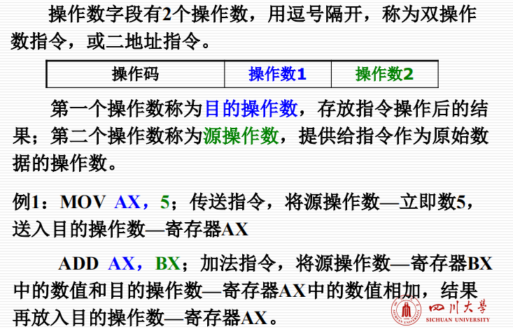

###### 单操作数指令

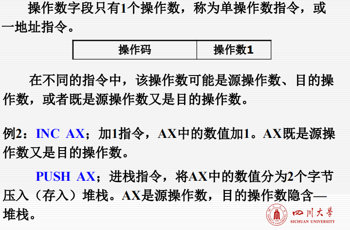

###### 无操作数指令

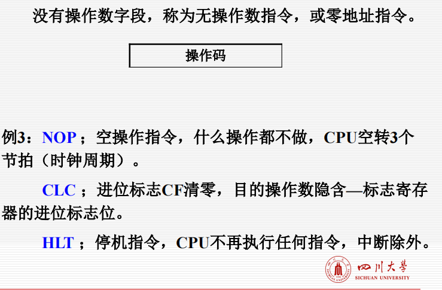

###### 指令长度

**指汇编指令对应机器指令的长度（以字节为单位）**

**指令的长度不同，占用的存储空间也不同。**

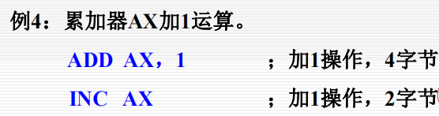

###### 指令执行时间

**指执行一条汇编指令需要的节拍（时钟周期）数。**

如果有多种类型的指令可以完成相同任务，那么选用较快的指令可以有效地压缩程序执行时间。

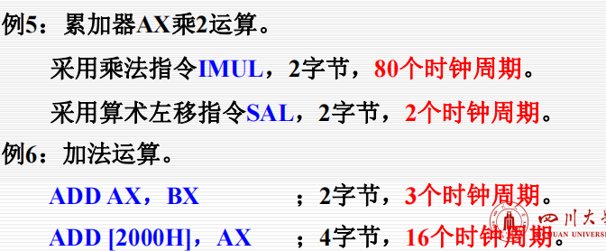

##### 2.寻址方式：**指令获取操作数的方式**

如果操作数放在寄存器中，或者作为立即数直接写在指令中，CPU不需要访问存储器（内存）就可以得到操作数。

如果操作数放在存储器中（内存），CPU就需要访问存储器（内存），指令中就要给出操作数的内存地址。

###### 寄存器寻址

**如果一条指令中的某个操作数地址是寄存器，那么称该指令按照寄存器寻址获取该操作数**

寄存器寻址的特点：寄存器在CPU内部，不需要执行系统总线周期，操作数读写速度快

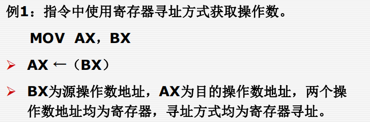

###### 立即数寻址

**如果指令所需要的操作数直接在指令代码中，称指令按照立即数寻址方式获取该操作数**

立即数寻址方式只能针对源操作数，不能针对目的操作数，因为立即数是数据本身，不是存储单元地址

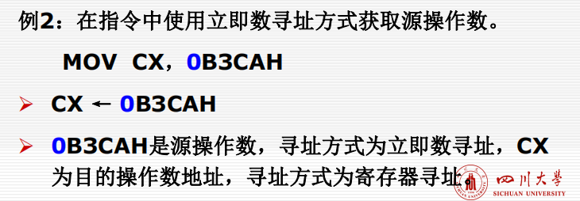

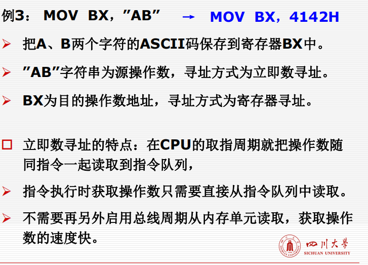

###### 存储器寻址

**针对内存单元的各种寻址方式统称为存储器寻址。**

寄存器寻址针对的操作数在寄存器中，不是针对在内存单元的操作数。

立即数寻址针对的操作数在指令中，不能把它和一般的内存操作数混淆起来。

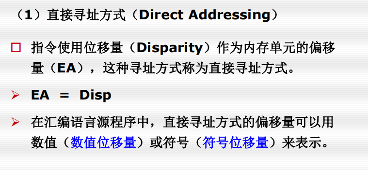

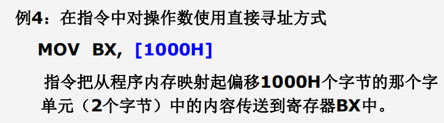

1000H是用数值表示的内存中的地址，源操作数寻址方式为直接寻址方式，位移量直接作为地址。

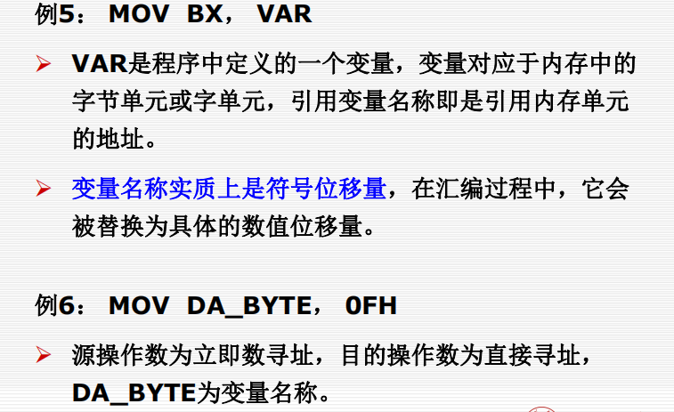

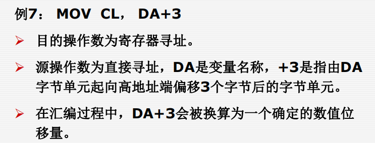


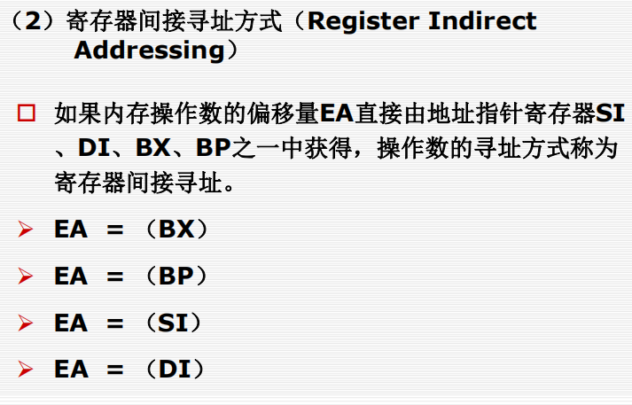

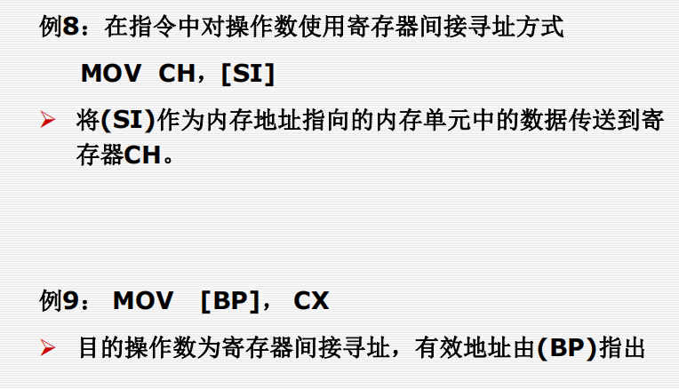


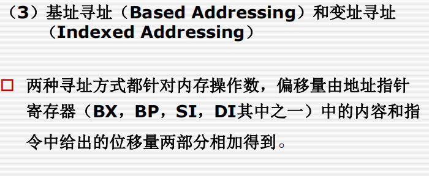

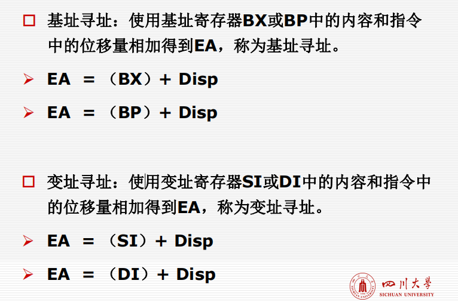

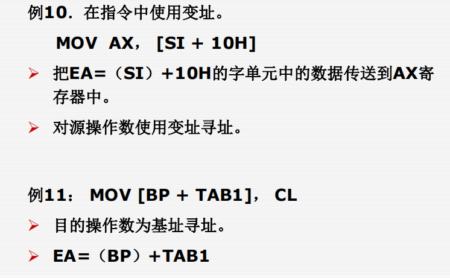


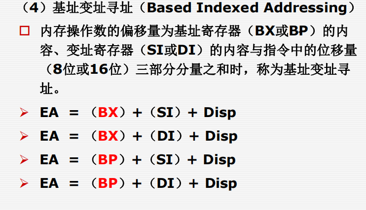

##### 实验

```c
int sum(int a, int b) {
00A12020  push        ebp  
00A12021  mov         ebp,esp  
00A12023  sub         esp,0C0h  
00A12029  push        ebx  
00A1202A  push        esi  
00A1202B  push        edi  
00A1202C  mov         edi,ebp  
00A1202E  xor         ecx,ecx  
00A12030  mov         eax,0CCCCCCCCh  
00A12035  rep stos    dword ptr es:[edi]  
   __asm {
       mov eax, a;
00A12037  mov         eax,dword ptr [a]  
       add eax, b;
00A1203A  add         eax,dword ptr [b]  
    }

}
00A1203D  pop         edi  
00A1203E  pop         esi  
00A1203F  pop         ebx  
00A12040  add         esp,0C0h  
00A12046  cmp         ebp,esp  
00A12048  call        __RTC_CheckEsp (0A11244h)  
00A1204D  mov         esp,ebp  
00A1204F  pop         ebp  
00A12050  ret  
```


#### 基本指令系统

##### 传送类指令

**把数据从一个存储位置搬运到另一个存储位置。**

传送指令负责把数据、地址或立即数传送到寄存器、存储器或端口号寄存器。它相对于高级语言里的赋值语句。

1.**数据传送类指令（Move）** 

**指令格式：MOV DEST，SRC**

在数据传送指令中，可使用各种寻址方式，但两个操作数中，只容许有一个为存储器寻址。


MOV BX，0024H  把0024H存在BX中

LEA AX， [BX] 把BX地址存在AX中

假定逻辑地址0024H指向的内存单元内容为0056H

