## 操作系统

### 第三章 进程描述和控制

1．所有多道程序操作系统的创建都围绕着进程的概念：

- 操作系统必须交替执行多个进程
- 操作系统必须按照特定的策略给进程分配资源
- 操作系统可以支持进程间的通信和用户创建进程

2．对本章内容的概述

3．提示虚拟内存在本章中偶尔会被引用到

#### 什么是进程

##### 1.背景

1．对第1章和第2章介绍的一些概念进行总结

2．操作系统管理应用程序的执行所达到的目的

##### 2.进程和进程控制块

1．第2章对进程下的几个定义

- 一个正在执行的程序
- 一个能在计算机上执行的程序实例
- 能分配给处理器并由处理器执行的实体
- 由一组执行的指令、一个当前状态和一组相关的系统资源表征的活动单元

进程的两个基本元素是程序代码和与代码相关联的数据集。

2．进程可以唯一的被表征为一些元素：

- 标识符

- 状态

- 优先级

- 程序计数器

- 内存指针

- 上下文数据

- I/O状态信息

- 审计信息

3．进程控制块的作用：

以下的列表信息被存放在一个称为进程控制块（process control block）的数据结构中，控制块由操作系统创建和管理。

The significant point about the process control block is that it contains sufficient information so that it is possible to interrupt a running process and later resume execution as if the interruption had not occurred.

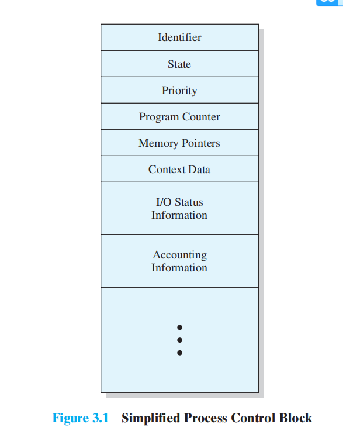

4．总结进程是由程序代码和相关数据还有进程控制块组成的

we can say that a process consists of program code and associated data plus a process control block. 

#### 进程状态

1．从处理器的角度和程序自身的角度来看进程执行的指令序列

2．将进程执行的指令序列称为进程的**轨迹**（trace）

all three processes are represented by programs that are fully loaded in main memory. In addition, there is a small **dispatcher** program that switches the processor from one process to another.

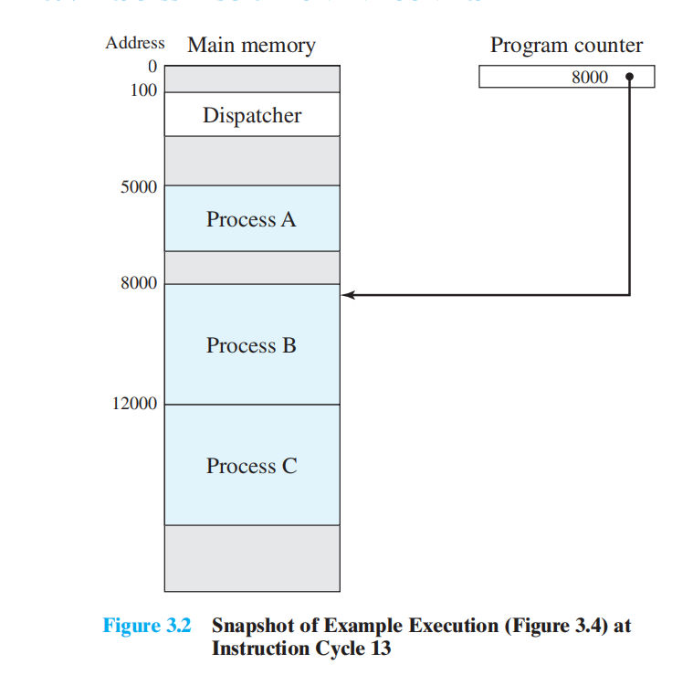

3．以一个简单的例子，通过给出各个进程的轨迹来描述处理器的行为

- Figure 3.2 M分布图

- Figure 3.3 程序角度

  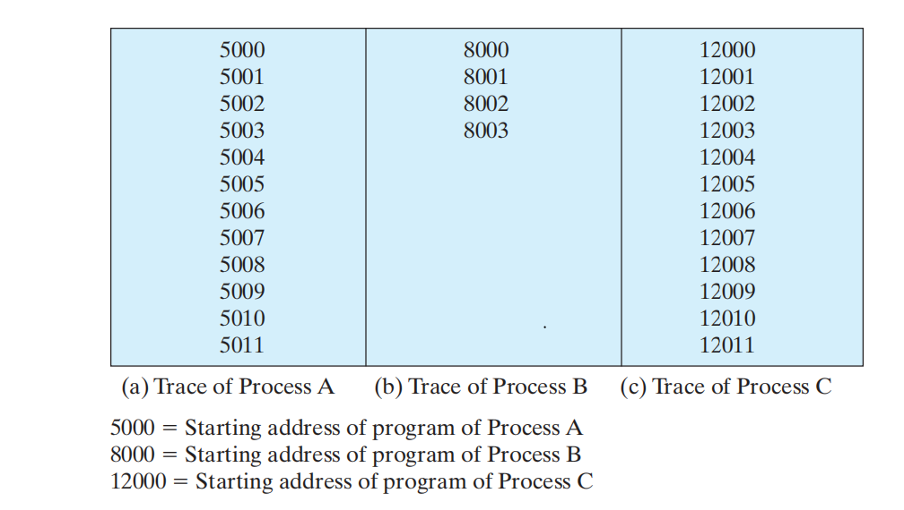

- Figure 3.4 CPU角度

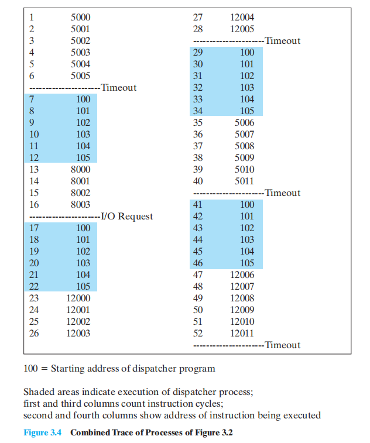

##### 1.两进程状态模型

1．操作系统在设计控制进程的程序时，第一步是描述进程的行为

2．进程的两状态及状态变迁

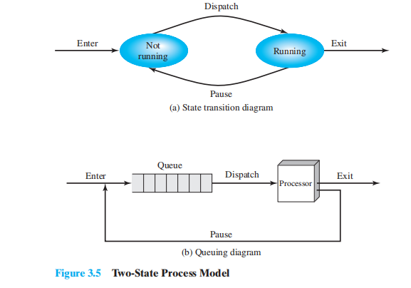

In this model, a process may be in one of two states: Running or Not Running, as shown in Figure 3.5a. When the OS creates a new process, it creates a process control block for the process and enters that process into the system in the Not Running state. The process exists, is known to the OS, and is waiting for an opportunity to execute. From time to time, the currently running process will be interrupted and the dispatcher portion of the OS will select some other process to run. The former process moves from the Running state to the Not Running state, and one of the other processes moves to the Running state.

3．以某种类型的队列来表示未运行的进程

4．排队图描述分派器的行为

We can describe the behavior of the dispatcher in terms of this queuing diagram. A process that is interrupted is transferred to the queue of waiting processes. Alternatively, if the process has completed or aborted, it is discarded (exits the system). In either case, the dispatcher takes another process from the queue to execute.

##### 2.**进程的创建和终止**

3.2.2.1进程的创建

1. 操作系统需要管理新进程的创建过程

2. 导致创建一个进程的四个事件

   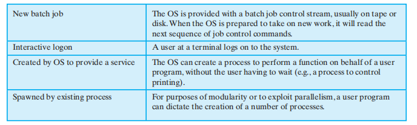

3. 进程派生

   When the OS creates a process at the explicit request of another process, the action is referred to as **process spawning**

4. 父进程与子进程

   When one process spawns another, the former is referred to as the **parent process**, and the spawned process is referred to as the **child process**.

3.2.2.2进程的终止

导致进程终止的原因

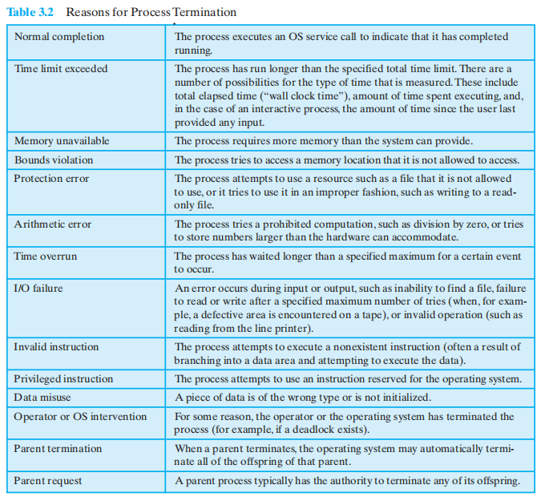

##### 3.五状态模型

1．五状态模型引入的原因

If all processes were always ready to execute, then the queuing discipline suggested

by Figure 3.5b would be effective.The queue is a first-in-first-out list and the processor 

operates in **round-robin** fashion on the available processes (each process in the

queue is given a certain amount of time, in turn, to execute and then returned to the

queue,unless blocked).However,even with the simple example that we have described,

this implementation is inadequate: some processes in the Not Running state are

ready to execute, while others are blocked, waiting for an I/O operation to complete.

Thus, using a single queue, the dispatcher could not just select the process at the oldest

end of the queue. Rather, the dispatcher would have to scan the list looking for the

process that is not blocked and that has been in the queue the longest.

2．五个状态为：Figure 3.6

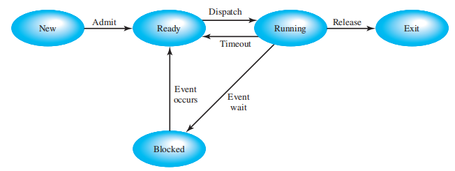

- 运行态

- 就绪态

- 阻塞态

- 新建态

- 退出态

3．新建态对进程管理的作用

the OS performs the necessary housekeeping chores. An identifier is associated with 

the process. Any tables that will be needed to manage the process are allocated and built.  

While a process is in the new state, information concerning the process that is needed by the

OS is maintained in control tables in main memory. However, the process itself is not in main 

memory. That is, the code of the program to be executed is not in main memory, and no space 

has been allocated for the data associated with that program. While the process is in the New 

state, the program remains in secondary storage, typically disk storage.5

4．退出态对进程管理的作用

Similarly, a process exits a system in two stages. First, a process is terminated

when it reaches a natural completion point, when it aborts due to an unrecoverable

error, or when another process with the appropriate authority causes the process to

abort. Termination moves the process to the exit state. At this point, the process is

no longer eligible for execution. The tables and other information associated with

the job are temporarily preserved by the OS, which provides time for auxiliary or

support programs to extract any needed information. For example, an accounting

program may need to record the processor time and other resources utilized by the

process for billing purposes. A utility program may need to extract information

about the history of the process for purposes related to performance or utilization

analysis. Once these programs have extracted the needed information, the OS no

longer needs to maintain any data relating to the process and the process is deleted

from the system

5．进程状态转换的几种事件类型：

- 空→新建

- 新建→就绪

- 就绪→运行

- 运行→退出

- 运行→就绪

- 运行→阻塞

- 阻塞→就绪

- 就绪→退出

- 阻塞→退出

6．单一的阻塞队列的实现过程

- Figure3.7

- Figure3.8(a)

  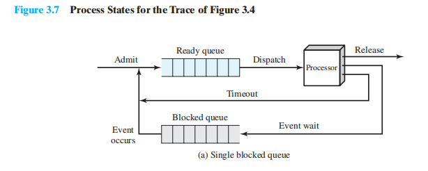

7．多条阻塞队列（一个等待事件对应一个队列）的实现过程

- Figure3.8(b)

  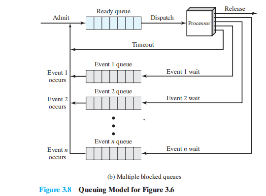

8．按照优先级维护多个就绪队列（一个优先级一个队列）

##### 4.被挂起的进程

交换的需要

1．许多实际的操作系统都是按照三个基本状态（就绪态、运行态和阻塞态）进行具体构造的

2．没有使用虚拟内存的系统，所有执行的进程必须完全载入主存

3．在上述情况下，单道程序系统和多道程序系统中，处理器在大多数时候是空闲的

4．解决方法之一，扩充主存以装入更多的进程。但有两个缺陷

5．解决方法之二，即交换

When none of the processes in main memory is in the Ready state, the OS swaps one of the blocked 

processes out onto disk into a suspend queue.This is a queue of existing processes that have been 

temporarily kicked out of main memory, or suspended. The OS then brings in another process from the 

suspend queue, or it honors a new-process request. Execution then continues with the newly arrived process.

6．交换通常会提高性能

7．以交换为解决方案，引入“挂起态”:Figure 3.9

8．操作系统比较倾向于调入被挂起的进程而不是新近创建的进程

9．导致的一个难题：所有已经挂起的进程在挂起时都处于阻塞态

10．通过进程的阻塞与否和挂起与否，将其组合为四个状态：

- 就绪态

- 阻塞态

- 阻塞/挂起态:  进程在外存中并等待一个事件

- 就绪/挂起态：进程已经在外存中，但只要载入内存就可以执行

11．在虚拟存储系统中进程的移入移出情况

【问题：虚拟内存的原理，和多活动进程在该系统中的情况】

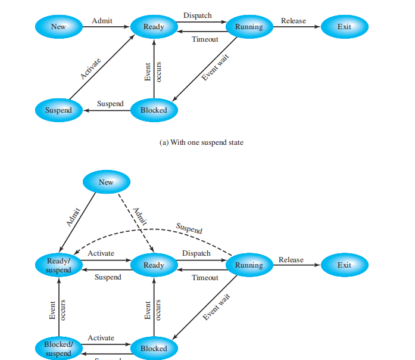

12．加入挂起态后比较重要的新状态转换：

- 阻塞→阻塞/挂起

- 阻塞/挂起→就绪/挂起

- 就绪/挂起→就绪

- 就绪→就绪/挂起

- 新建→就绪/挂起以及新建→就绪

- 阻塞/挂起→阻塞

- 运行→就绪/挂起

- 各种状态→退出

3.2.4.2挂起的其他用途

1．挂起程序等于不在内存中的程序，不管是否在等待事件，都不能立即执行

2．挂起态进程具有的特点：

- 进程不能立即执行

- 进程可能是或不是正在等待一个事件

- 可以通过代理把进程置于挂起态

- 除非代理显式的命令系统进行状态转换，否则进程无法从这个状态中转移

3．进程的一些挂起原因

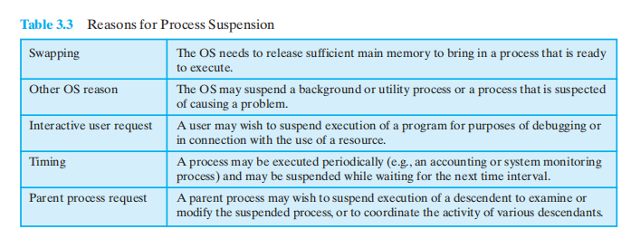

 

#### 进程描述

1．操作系统是管理系统资源的实体

2．进程在执行期间需要访问某些系统资源：包括处理器 IO设备 和内存

3．提出问题：操作系统为了控制进程和管理资源需要哪些信息？

##### 1.操作系统代表进程管理系统资源

1．为了管理进程和资源，操作系统维护着四种不同类型的表：**内存、I/O、文件和进程**

2．内存表用于跟踪主存和辅存。内存表包括如下信息：

- 分配给进程的主存

- 分配给进程的辅存

- 主存块或虚拟内存块的任何保护属性

- 管理虚拟内存所需要的任何信息

3．I/O表管理计算机系统中的I/O设备和通道

4．文件表提供关于文件的信息

5.为管理进程，操作系统必须维护进程表（process tables）

6．四种表必须以某种方式链接起来或相互交叉引用

7．操作系统最初如何知道创建表

##### 2.操作系统的控制结构

3.3.2.1进程位置

1．进程控制块和进程映像(process image)概念的提出

Typically, the collection of attributes is referred to as a **process control block**.7 We can refer to this collection of program, data, stack, and attributes as the **process image** (Table 3.4).

2．进程映像的位置依赖于使用的内存管理方案

最简单的情况下保存在相邻的内存块或连续的内存块中。

3．操作系统维护都进程表必须表明每个进程映像中每页的位置

4．Figure 3.12描绘了位置信息的结构

【说明：进程的image：在 外存中 VS 在内存中： Linker and Loader所起的作用】

3.3.2.2进程属性

1． 复杂都多道程序系统需要关于每个进程的大量信息

2． 结合表3.5将进程控制块信息分成三类：

- 进程标识号

- 进程状态信息

- 进程控制信息

3． 1/3类：进程标识号的用途

4． 2/3类：处理器状态信息的用途

5． 3/3类：进程控制信息的范围

6． 结合Figure 3.13给出了虚拟内存中进程映像的结构

7． 进程控制块还包括将其链接起来的指针：Figure 3.14

3.3.2.3进程控制块的作用

1．进程控制块集合定义了操作系统的状态

2．进程控制块带来的关于不是访问而是保护方面的问题：

一个例程中有错误，可能会破坏进程控制块，从而破坏了系统对受影响进程的管理能力

进程控制块的结构或语义的设计变化可能会影响到操作系统中的许多模块

3．可以用一个专门的处理例程来解决这些问题

#### 进程控制

##### 1.执行模式

1． 需要区分通常与操作系统相关联的以及与用户程序相关联的处理器执行模式

2． 用户模式与内核模式的提出，表3.7列出了操作系统内核中通常可以找到的功能

3． 使用两种模式的原因

4． 使用两种模式产生的两个问题：处理器如何知道它正在什么模式下执行以及如何改变这一模式

##### 2.进程创建

进程创建的过程：

1．给新进程分配一个唯一的进程标识号

2．给进程分配空间

3．初始化进程控制块

4．设置正确的连接

5．创建或扩充其他数据结构

##### 3.进程切换

 3.4.3.0 Pre

提出进程切换引发的若干问题

3.4.3.1何时切换进程

1．结合表3.8给出了可能把控制权交给操作系统的事件：中断、陷阱和系统调用

2．普通中断的处理过程。几种常见的中断：

- 时钟中断

- I/O中断

- 内存失效

3．对于陷阱，操作系统根据错误或异常条件是否是致命的来进行相应处理

4．系统调用。通常使用系统调用会导致把用户进程置为阻塞态

3.4.3.2模式切换

1．在中断阶段中，对一个未处理的中断，处理器需要做的工作：

- 把程序计数器置成中断处理器的开始地址

- 把处理器模式从用户模式切换到内核模式

- 继续取指阶段

2．保存的进程上下文包括进程控制块中的处理器状态信息

3．中断处理器通常执行一些与中断相关的基本任务的小程序

4．对进程控制块中的其他信息进行处理

3.4.3.3进程状态的变化

进程切换涉及到状态变化，比模式切换需要做更多的工作。进程切换步骤：

1．保存处理器上下文

2．更新当前处于运行态的进程的进程控制块

3．把进程的进程控制块移到相应的队列

4．选择另一个进程执行

5．更新所选择进程的进程控制块

6．更新内存管理的数据结构

7．恢复处理器在被选择的进程最近一次切换出运行态时的上下文

##### 4.操作系统的执行

3.4.4.0 Pre

结合第2章给出的关于操作系统的两个特殊事实，提出了几个问题：操作系统是一个进程吗？如果是，如何控制它？图3.15给出了各种操作系统中使用的各种方法

3.4.4.1无进程的内核

无进程的内核是指在所有的进程之外执行操作系统内核

进程的概念仅仅适用于用户程序，操作系统代码作为一个在特权模式下工作的独立实体被执行

3.4.4.2在用户进程中执行

1．这种策略是在用户进程的上下文中执行所有操作系统软件：Figure 3.15

2．Figure 3.16给出了这个策略下的一个典型的进程映像结构。操作系统代码和数据位于共享地址空间中，被所有的用户进程共享

3．当发生中断、陷阱或系统调用时，不需要执行进程切换，只需在同一进程中模式切换

4．如果确定需要进程切换，则由进程切换例程来处理，取决于系统的设计

5．这种策略非常值得注意。进程切换时不能保存其状态信息，因为进程执行的代码是共享的操作系统代码，不能被篡改。

【问题：进程和程序的概念是不同的，不是一对一的关系。】

【问题：在一个进程中，用户程序和操作系统程序都有可能执行，而在不同用户进程中执行的操作系统程序是相同的。】

3.4.4.3基于进程的操作系统

1．这种策略是把操作系统作为一组系统进程来实现

2．这种策略的几个优点

#### UNIX SVR4进程管理

此系统采用“在用户进程中执行”的操作系统策略。涉及到用户模式和内核模式，系统进程和用户进程的区分。

##### 1. 进程状态

1．表3.9描述了UNIX系统的9种进程状态，图3.17是其进程状态转换图

2．此进程状态转换与之前的区别在于：

n 采用了两个运行态来区别是在用户模式还是内核模式下执行

n 区分两个状态：内存中运行就绪态和被抢占态（问题：如何进入被抢占态，区别究竟是什么）

3． 只有当进程准备从内核模式移到用户模式才可能发生抢占，这使得UNIX不适用于实时处理【问题】

4． UNIX的两个独特的进程：进程0和进程1

##### 2. 进程描述

1．表3.10概括了UNIX进程映像中的元素，包括三部分：用户上下文、寄存器上下文和系统级上下文。

2．用户级上下文和寄存器上下文分别在什么情况下存储处理器状态信息

3．系统级上下文包含操作系统管理进程所需要都其余信息。表3.11列出了进程表项的内容，表3.12列出了用户区的内容

4．进程表项和U区的区别

5．本进程区表和内核栈

##### 3. 进程控制

1．UNIX通过内核系统调用fork（）来创建进程，介绍具体执行过程

2．创建成功后继续三种操作之一：在父进程中继续执行；子进程中执行；控制权转交给另一个进程

3．通过fork（）的返回参数来确定是在父进程还是子进程中执行

