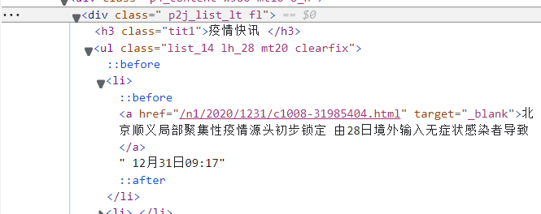
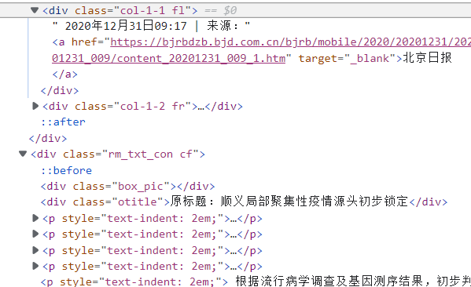
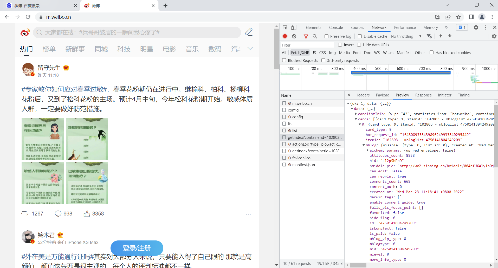
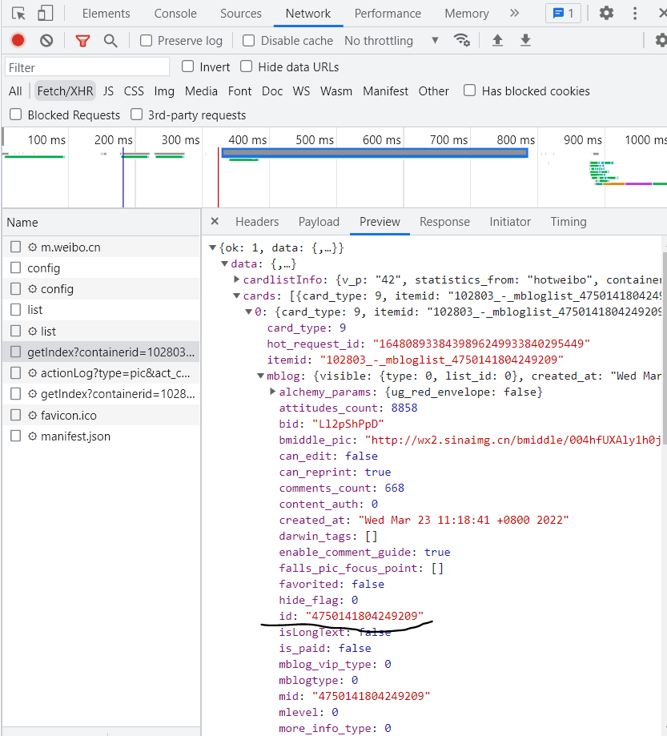
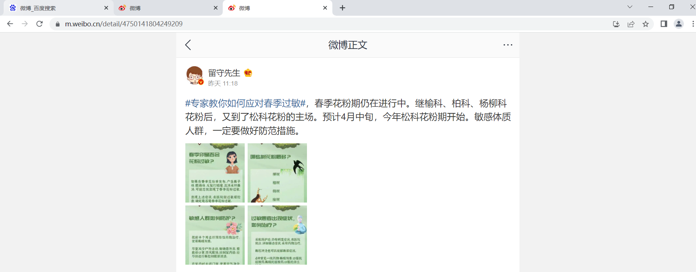
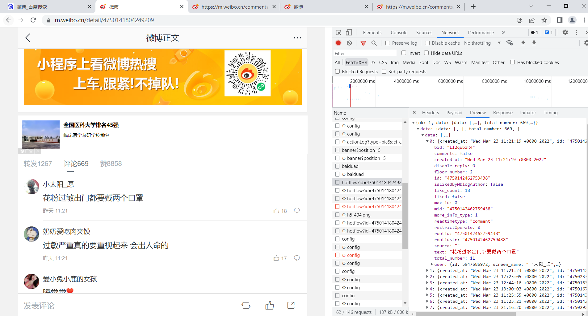
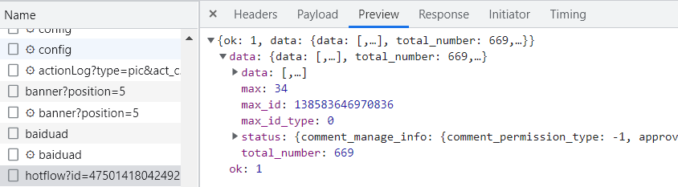
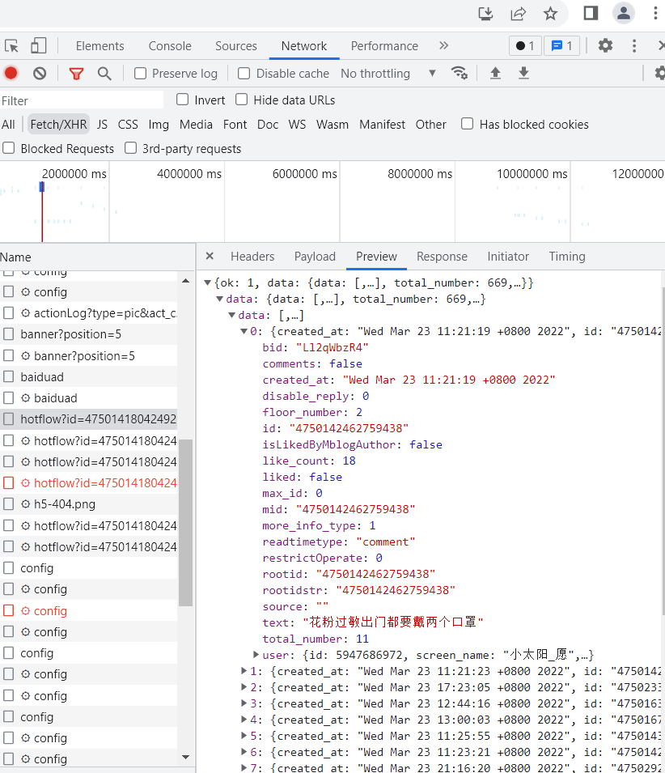

### 爬虫

#### 信息网站爬虫

##### 1.引入库

```python
# -*- coding: utf-8 -*-
import os
import re
import csv
import time
import json
import random
import urllib.request
from lxml import etree
from bs4 import BeautifulSoup
from selenium import webdriver
from selenium.webdriver.chrome.options import Options
```

##### 2.基本信息写入文件

```python
path = os.getcwd() + "/rmw_data.csv"   #得到当前路径
csvfile = open(path, 'a', newline='', encoding = 'utf-8-sig')
#open() 函数用于打开一个文件，创建一个 file 对象，相关的方法才可以调用它进行读写。
writer = csv.writer(csvfile) 
writer.writerow(('序号','文章标题','发布时间','文章链接','文章内容')) 
```

##### 3.数据抓取

```python
url = "http://society.people.com.cn/GB/369130/431577/431608/index.html"
driver = webdriver.Chrome() #chromedriver.exe置于python37根目录
driver.implicitly_wait(5)#等待五秒定位
chrome_option = webdriver.ChromeOptions()
driver.get(url) #打开网页网页
driver.implicitly_wait(6) #等待加载六秒
```

##### 4.获取标题

```python
titles = driver.find_elements_by_xpath('//div[@class=" p2j_list_lt fl"]/ul/li')
#根据html中的标签获取标题
for t in titles:
    print(t.text)

links = driver.find_elements_by_xpath('//div[@class=" p2j_list_lt fl"]/ul/li/a')

for link in links:
    print(link.get_attribute('href'))
#根据html中的标签获取超链接

print("\n\n==========================================================")
```



##### 5.获取正文

```python
def get_content(url):
    print(url)
    time.sleep(random.randint(1000,3000)/1000.0)
    try:
        content = urllib.request.urlopen(url).read()#发出请求并爬取页面上的信息，将内容打开
        soup = BeautifulSoup(content,"html.parser")#用BeautifulSoup进行html解析
        #来源
        ly = soup.find(attrs={"class":"col-1-1 fl"}).get_text()
        #print(ly)
        #正文
        zw = soup.find(attrs={"class":"rm_txt_con cf"})
        #防止某些文章仅图片
        if zw is not None:
            zw = zw.get_text()
            zw = zw.replace("\n", "")
        else:
            zw = ""
        print(zw)
        print("succeed")
        return ly,zw
    except Exception as e:
        zw = e.partial
        ly = ""
        print("except")
        print(zw)
    return ly, page
```



##### 6.写入文件

```python
k = 0
while k<len(titles):
    #序号
    num = str(k+1)
    #文章标题和发布时间
    value = titles[k].text.split('\n')
    con_title = value[0]
    con_time = value[1]
    #文件链接
    url = links[k].get_attribute('href')
    #获取来源和正文
    ly,zw = get_content(url)
    content = (num, con_title, con_time, url, zw)
    #文件写入操作
    writer.writerow((content))
    k = k + 1

#文件关闭
csvfile.close() 
```

#### 微博爬虫

##### 1.引入库

```python
# -*- coding: utf-8 -*-
import requests,random,re
import time
import os
import csv
import sys
import json
import importlib
from fake_useragent import UserAgent
from lxml import etree
import jieba
import wordcloud

importlib.reload(sys)
startTime = time.time() #记录起始时间
```

##### 2.文件存储

```python
path = os.getcwd() + "/weiboComments.txt"
f = open(path, 'a', newline='', encoding = 'utf-8-sig')
# writer = csv.writer(csvfile)
#csv头部
# writer.writerow(('话题链接','话题内容','楼主ID', '楼主昵称', '楼主性别','发布日期',
#                  '发布时间', '转发量','评论量','点赞量', '评论者ID', '评论者昵称',
#                  '评论者性别', '评论日期', '评论时间','评论内容'))

#设置heades模拟浏览器访问网站
headers = {
    'Cookie': '_T_WM=22822641575; H5_wentry=H5; backURL=https%3A%2F%2Fm.weibo.cn%2F; ALF=1584226439; MLOGIN=1; SUBP=0033WrSXqPxfM725Ws9jqgMF55529P9D9W5RJaVYrb.BEuOvUQ8Ca2OO5JpX5K-hUgL.FoqESh-7eKzpShM2dJLoIp7LxKML1KBLBKnLxKqL1hnLBoMceoBfeh2EeKBN; SCF=AnRSOFp6QbWzfH1BqL4HB8my8eWNC5C33KhDq4Ko43RUIzs6rjJC49kIvz5_RcOJV2pVAQKvK2UbAd1Uh6j0pyo.; SUB=_2A25zQaQBDeRhGeBM71cR8SzNzzuIHXVQzcxJrDV6PUJbktAKLXD-kW1NRPYJXhsrLRnku_WvhsXi81eY0FM2oTtt; SUHB=0mxU9Kb_Ce6s6S; SSOLoginState=1581634641; WEIBOCN_FROM=1110106030; XSRF-TOKEN=dc7c27; M_WEIBOCN_PARAMS=oid%3D4471980021481431%26luicode%3D20000061%26lfid%3D4471980021481431%26uicode%3D20000061%26fid%3D4471980021481431',
    'Rsferer' : 'https://m.weibo.cn/search?containerid=100103type%3D1%26q%3D%E6%88%90%E9%83%BD%E7%96%AB%E6%83%85',
    'User-Agent': 'Mozilla/5.0 (Windows NT 10.0; Win64; x64) AppleWebKit/537.36 (KHTML, like Gecko) Chrome/80.0.3987.100 Safari/537.36',
    'X-Requested-With': 'XMLHttpRequest'
}
```

##### 3.爬取微博话题的每个主题的ID

```python
comments_ID = []
def get_title_id():
    for page in range(1,8):  #每个页面大约有18个话题
        headers = {
            "User-Agent" : UserAgent().chrome #chrome浏览器随机代理
        }
        time.sleep(1)
        
        api_url = 'https://m.weibo.cn/api/container/getIndex?containerid=100103type%3D60%26q%3D%E5%9B%9B%E5%B7%9D%E5%A4%A7%E5%AD%A6+%E9%98%B2%E7%96%AB%26t%3D0&page_type=searchall&page=' + str(page)
        #链接在检查中浏览器返回的包中找到 且每下拉刷新一次page会加一
        print(api_url)
        rep = requests.get(url=api_url, headers=headers)
        #获取ID值并写入列表comment_ID中
        for json in rep.json()['data']['cards']:
            json = json['mblog']
            comment_ID = json['id']
            comments_ID.append(comment_ID)
```







##### 4.爬取每条微博的详情信息

```python
def spider_title(comment_ID):
    try:
        article_url = 'https://m.weibo.cn/detail/'+ comment_ID
        print ("article_url = ", article_url)
        html_text = requests.get(url=article_url, headers=headers).text
        #话题内容
        find_title = re.findall('.*?"text": "(.*?)",.*?', html_text)[0]
        title_text = re.sub('<(S*?)[^>]*>.*?|<.*? />', '', find_title) #正则匹配掉html标签
        print ("title_text = ", title_text)
        #楼主ID
        title_user_id = re.findall('.*?"id": (.*?),.*?', html_text)[1]
        print ("title_user_id = ", title_user_id)
        #楼主昵称
        title_user_NicName = re.findall('.*?"screen_name": "(.*?)",.*?', html_text)[0]
        print ("title_user_NicName = ", title_user_NicName)
        #楼主性别
        title_user_gender = re.findall('.*?"gender": "(.*?)",.*?', html_text)[0]
        print ("title_user_gender = ", title_user_gender)
        #发布时间
        created_title_time = re.findall('.*?"created_at": "(.*?)".*?', html_text)[0].split(' ')
        #日期
        if 'Mar' in created_title_time:
            title_created_YMD = "{}/{}/{}".format(created_title_time[-1], '03', created_title_time[2])
        elif 'Feb' in created_title_time:
            title_created_YMD = "{}/{}/{}".format(created_title_time[-1], '02', created_title_time[2])
        elif 'Jan' in created_title_time:
            title_created_YMD = "{}/{}/{}".format(created_title_time[-1], '01', created_title_time[2])
        elif 'Apr' in created_title_time:
            title_created_YMD = "{}/{}/{}".format(created_title_time[-1], '04', created_title_time[2])
        elif 'May' in created_title_time:
            title_created_YMD = "{}/{}/{}".format(created_title_time[-1], '05', created_title_time[2])
        else:
            title_created_YMD = "{}/{}/{}".format(created_title_time[-1], '00', created_title_time[2])
        
        print ("title_created_YMD = ", title_created_YMD)
        #发布时间
        add_title_time = created_title_time[3]
        print ("add_title_time = ", add_title_time)
        #转发量
        reposts_count = re.findall('.*?"reposts_count": (.*?),.*?', html_text)[0]
        print ("reposts_count = ", reposts_count)
        #评论量
        comments_count = re.findall('.*?"comments_count": (.*?),.*?', html_text)[0]
        print ("comments_count = ", comments_count)
        #点赞量
        attitudes_count = re.findall('.*?"attitudes_count": (.*?),.*?', html_text)[0]
        print ("attitudes_count = ", attitudes_count)   
        comment_count = int(int(comments_count) / 20) #每个ajax一次加载20条数据
        #position1 = (article_url, title_text, title_user_id, title_user_NicName,title_user_gender, title_created_YMD, add_title_time, reposts_count, comments_count, attitudes_count, " ", " ", " ", " "," ", " ")
        #写入数据

        #writer.writerow((position1))
        f.write(title_text+ '\n\n')
        return comment_count
    except:
        pass
```

##### 5.获取评论信息

```python
#comment_ID话题编号
def get_page(comment_ID, max_id, id_type):
    params = {
        'max_id': max_id,
        'max_id_type': id_type
    }
    url = ' https://m.weibo.cn/comments/hotflow?id={}&mid={}&max_id_type={}'.format(comment_ID, comment_ID,id_type)
    print(url)
    try:
        r = requests.get(url, params=params, headers=headers)
        if r.status_code == 200:
            return r.json()
    except requests.ConnectionError as e:
        print('error', e.args)
        pass
```



##### 6.抓取评论数

```python
#jsondata = get_page(comment_ID, m_id, id_type)
def parse_page(jsondata):
    if jsondata:
        items = jsondata.get('data')
        item_max_id = {}
        item_max_id['max_id'] = items['max_id']
        item_max_id['max_id_type'] = items['max_id_type']
        return item_max_id
```



##### 7.抓取评论信息

```python
def write_csv(jsondata):
    f.write('评论'+'\n')
    for json in jsondata['data']['data']:
        #用户ID
        user_id = json['user']['id']
        # 用户昵称
        user_name = json['user']['screen_name']
        # 用户性别,m表示男性，表示女性
        user_gender = json['user']['gender']
        #获取评论
        comments_text = json['text']
        comment_text = re.sub('<(S*?)[^>]*>.*?|<.*? />', '', comments_text) #正则匹配掉html标签
        print(comment_text)
        # 评论时间
        created_times = json['created_at'].split(' ')
        if 'Feb' in created_times:
            created_YMD = "{}/{}/{}".format(created_times[-1], '02', created_times[2])
        elif 'Jan' in created_times:
            created_YMD = "{}/{}/{}".format(created_times[-1], '01', created_times[2])
        elif 'Mar' in created_times:
            created_YMD = "{}/{}/{}".format(created_times[-1], '03', created_times[2])
        elif 'Apr' in created_times:
            created_YMD = "{}/{}/{}".format(created_times[-1], '04', created_times[2])
        elif 'May' in created_times:
            created_YMD = "{}/{}/{}".format(created_times[-1], '05', created_times[2])
        else:
            created_YMD = "{}/{}/{}".format(created_times[-1], '00', created_times[2])
        created_time = created_times[3] #评论时间时分秒
        #if len(comment_text) != 0:
        position2 = (" ", " ", " ", " "," ", " ", " ", " ", " ", " ", user_id, user_name, user_gender, created_YMD, created_time, comment_text)
        #writer.writerow((position2))#写入数据
        #print (user_id, user_name, user_gender, created_YMD, created_time)
        #f.write(position2 + '\n\n')
        f.write(comment_text)
    f.write('\n\n')
```



##### 8.生成云图

```python
def wordcloud_image():
    file = open('./weiboComments.txt', encoding='utf-8')
    exclude={'我们','你们','他们','它们','因为','因而','所以','如果','那么',\
'如此','只是','但是','就是','这是','那是','而是','而且','虽然','这些',\
'有些','然后','已经','于是','一种','一个','一样','时候','没有','什么',\
'这样','这种','这里','不会','一些','这个','仍然','不是','自己','知道',\
'可以','看到','那儿','问题','一会儿','一点','现在','两个','三个','真的','只有','评论','学生','学校'}
#将一些常用词排除
    txt = file.read()
    file.close()
    ls = jieba.lcut(txt)
    ls = [word for word in ls if len(word) > 1]#过滤单字
    txt = " ".join(ls)
    w = wordcloud.WordCloud(width=1000, height=700, font_path="msyh.ttc",stopwords=exclude)
    jieba.del_word('全文')
    w.generate(txt)
    w.to_file("scufangyi.jpg")
```


##### 9.主函数

```python
def main():
    count_title = len(comments_ID)
    for count, comment_ID in enumerate(comments_ID):
        print ("正在爬取第%s个话题，一共找到个%s话题需要爬取"%(count+1, count_title))
        time.sleep(random.randint(1000,2000)/1000.0)
        #maxPage获取返回的最大评论数量
        maxPage = spider_title(comment_ID)
        print ('maxPage = ', maxPage)
        m_id = 0
        id_type = 0
        if maxPage != 0: #小于20条评论的不需要循环
            try:
                #用评论数量控制循环
               for page in range(0, maxPage):
                     #自定义函数-抓取网页评论信息
                    jsondata = get_page(comment_ID, m_id, id_type)
                    
                    #自定义函数-写入CSV文件
                    write_csv(jsondata)
                    
                    #自定义函数-获取评论item最大值
                    results = parse_page(jsondata)
                    time.sleep(1)
                    m_id = results['max_id']
                    id_type = results['max_id_type']
            except:
               pass
        print ("--------------------------分隔符---------------------------")
    f.close()
    
if __name__ == '__main__':
    
    #获取话题ID
    get_title_id()
    
    #主函数操作
    main()
    wordcloud_image()
    #计算使用时间
    endTime = time.time()
    useTime = (endTime-startTime) / 60
    print("该次所获的信息一共使用%s分钟"%useTime)
```

