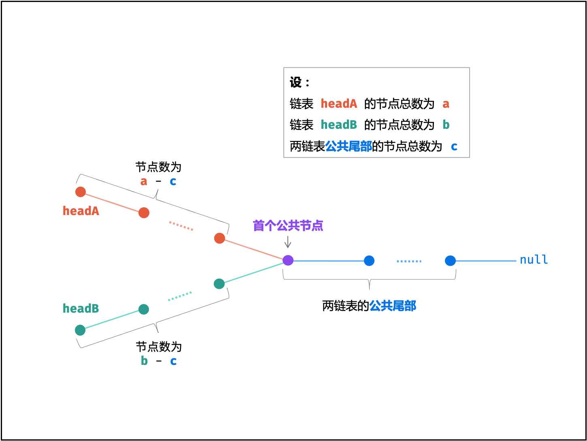
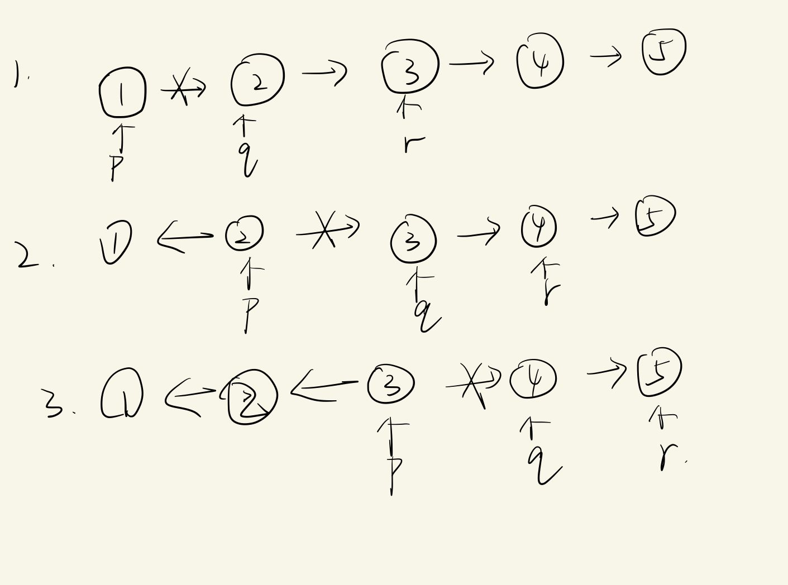
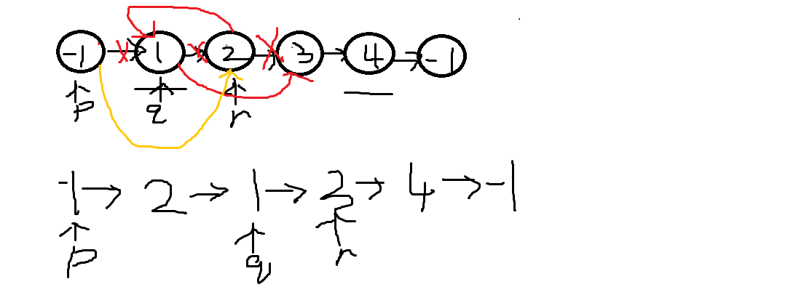

### 链表有关题目

#### 1.[合并两个有序链表](https://leetcode-cn.com/problems/merge-two-sorted-lists/)


```python
struct ListNode* mergeTwoLists(struct ListNode* list1, struct ListNode* list2){
  struct ListNode *p, *q,*r;
  struct ListNode *list3=(struct ListNode *)malloc(sizeof(struct ListNode));
   p=list1;
  q=list2;
  r=list3;
  if(!p&&!q){
      return NULL;
  }
  if(p&&!q){
      return p;
  }
  if(!p&&q){
      return q;
  }
 
  while(p&&q){
      if(p->val<q->val){
      r->next=p;
      r=r->next;
      p=p->next;
            }
            else{
      r->next=q;
      r=r->next;
      q=q->next;
            }
  }
if(p!=NULL){
    r->next=p;
}
if(q!=NULL){
    r->next=q;
}
return list3->next;
}
```

思路：新建一个链表，逐个插入即可

问题：malloc（）方法的使用问题。该函数返回一个指针 ，指向已分配大小的内存。如果请求失败，则返回 NULL。

#### 2.[相交链表](https://leetcode-cn.com/problems/intersection-of-two-linked-lists/)


方法一：时间复杂度 空间复杂度高 

```python
struct ListNode *getIntersectionNode(struct ListNode *headA, struct ListNode *headB) {
    struct ListNode *p,*q;
    p=headA;
    q=headB;
    while(p&&q){
    
        if(p==q)return p;
        while(q){
            q=q->next;
            if(p==q)return p;
        }
        p=p->next;
        q=headB;

    }
    return NULL;
}
```

思路：双循环，用b上的每一个结点和a上的结点依次比较

补充：条件运算符（conditional operator）有时候也称为三元运算符（ternary operator，或者trinary operator），因为它是唯一需要 3 个操作数的运算符：**条件 ? 表达式1 : 表达式2**

方法二：

```python
struct ListNode *getIntersectionNode(struct ListNode *headA, struct ListNode *headB) {
        struct ListNode *p, *q;

        for (p = headA, q = headB; p != q; ){
            if (p != NULL)
                p = p->next;
            else p = headB;
            if (q != NULL)
                q = q->next;
            else q = headA;
        }

        return p;
}

```

思路：双指针，两个指针将图中的每一个点都遍历了一遍，所以会指向同一结点



#### 3.[反转链表](https://leetcode-cn.com/problems/reverse-linked-list/)


```c
struct ListNode* reverseList(struct ListNode* head){
struct ListNode* p,*q,*r;

p=head;
if(!p){return NULL;}
q=p->next;
p->next=NULL;
if(!q) {return head;}
r=q->next;
while(r){
    q->next=p;
    p=q;
    q=r;
    r=r->next;
    
}
q->next=p; 
return q;
}
```

思路：

#### 4.[分隔链表](https://leetcode-cn.com/problems/partition-list/)

给你一个链表的头节点 head 和一个特定值 x ，请你对链表进行分隔，使得所有 小于 x 的节点都出现在 大于或等于 x 的节点之前。

你应当 保留 两个分区中每个节点的初始相对位置。


```c
struct ListNode* partition(struct ListNode* head, int x){
struct ListNode *small,*large,*p,*q,*r;
if(!head)return NULL;
p=head;
small=malloc(sizeof(struct ListNode));
large=malloc(sizeof(struct ListNode));
q=small;
r=large;
while(p){
    if(p->val<x){
     small->next=p;
     small=small->next; 
     p=p->next;
    }
    else{
   large->next=p;
   large=large->next;
   p=p->next;
    }
   
}

large->next=NULL;
 small->next=r->next;

return q->next;}
```

思路：按顺序将小于x的组合为一个链表，大于等于x的组合为一个链表，最后将两链表合并

#### 5.[环形链表 II](https://leetcode-cn.com/problems/linked-list-cycle-ii/)


思路：使用快慢指针，一个一次走一步，一个一次走两步，根据计算，若存在环，则两指针一定会相遇，设链表中环外部分的长度为 a。slow 指针进入环后，又走了 b 的距离与fast 相遇。此时，fast 指针已经走完了环的 n圈，因此它走过的总距离为 a+n(b+c)+b=a+(n+1)b+nc。则*a*+(*n*+1)*b*+*n*c*=2(*a*+*b*)⟹*a*=*c*+(*n*−1)(*b*+*c)，可以导出会在距离入环口a处相遇。此时在头结点设一指针，与慢指针一起移动，相遇时既是距离头部a步的结点，也是入环点。

```c
truct ListNode *p,*q,*r;
    p=head;
    q=head;
    while(q&&q->next){
        p=p->next;
        q=q->next->next;
        if(p==q){
           r=head;
           while(r!=p){
               p=p->next;
               r=r->next;
           }
           return r;
        }
    }
    return NULL;
}
```

#### 6.[反转链表 II](https://leetcode-cn.com/problems/reverse-linked-list-ii/)


思路：使用双指针头插法，用指针标记翻转的头结点的前驱结点，此时需插入的结点，以及该结点的后继结点。并将结点依次插入到头结点之前。需要注意的是这种标记方法可能使指针指向空节点，所以提前在链表头插入一个结点，以免出现错误。



```c
struct ListNode* reverseBetween(struct ListNode* head, int left, int right){
if(head==NULL)return NULL;
int i=1; 
struct ListNode*p,*q,*r,*s;
p=(struct ListNode*)malloc(sizeof(struct ListNode));
s=p;
p->next=head;

while(i<left){
p=p->next;
i++;
}
q=p->next;
i=left;
r=q->next;
while(i<right){
if(r==NULL){
    r=(struct ListNode*)malloc(sizeof(struct ListNode));
    r->next=NULL;
    r->val=-1;
}
q->next=r->next;
r->next=p->next;
p->next=r;
r=q->next;
i++;

}
return s->next;

}
```

#### 7.[复制带随机指针的链表](https://leetcode-cn.com/problems/copy-list-with-random-pointer/)


思路：根据遍历到的原节点创建对应的新节点，每个新创建的节点是在原节点后面，将新节点的随机指针设置为原结点随机指针的next，再将两链表分开，即可得到一个复制出来的新链表。


```c
struct Node* copyRandomList(struct Node* head) {
    if(!head)return NULL;
	struct Node *p,*q,*r,*Head;
    p=head;
    //将所有结点复制一次连接在一起
    while(p){
        q=p->next;
        r=(struct Node*)malloc(sizeof(struct Node));
        r->val=p->val;
        p->next=r;
        r->next=q;
        p=q;
       
    }
    //将新结点连到随机指针指向的结点的next
    p=head;
    while(p){
        q=p->next;
        if(p->random){
            q->random=p->random->next;
        }
        else{
            q->random=NULL;
        }
        p=q->next;
    }
   //将两链表分开
   Head=head->next;
   p=head;
   q=p->next;
   r=q->next;
   while(p&&r){
       p->next=r;
       q->next=r->next;
       p=r;
       q=p->next;
       r=q->next;
       
   }
   p->next=NULL;
   q->next=NULL;
   return Head;
}
```

