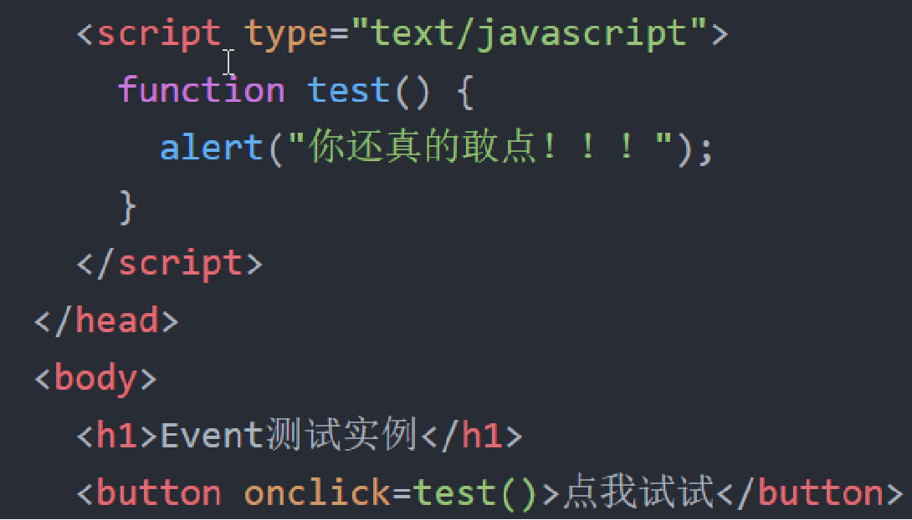

## Javascript

#### 功能：

##### 1.操控页面元素，实现动态页面（DOM）

##### 2.监听浏览器事件，辅助实现响应式页面（BOM）

##### 3.浏览器编程

#### 数据类型

- String 字符串

- Number 数值

- Boolean 布尔类型

- Object 对象类型

- Null 空

- Undefined 未定义类型

  

#### 数组

可以是不同的类型，具有属性和方法

#### 字符串

也是一种对象，具有属性和方法

#### 对象

属性可以动态增加删除

判断对象是否有某一属性：object.hasOwnProperty('sex');

#### 完整的javascript

##### ECMAScript

规定了语法、类型、语句、关键词、保留字、操作符、对象

##### BOM(Browser object model)

浏览器对象模型，与浏览器交互的方法和接口，BOM介于各个浏览器厂商对浏览器的不同规定，所以兼容性很差。

##### DOM(Document object Model)

（文档对象模型）是 HTML 的应用程序接口（API），它主要包含了获取元素、修改样式、操作元素三个方面的内容，DOM 是 W3C 的标准，是所有浏览器遵守的标准。

#### 浏览器对象（BOM）

##### 1.window对象

window指的是浏览器的窗口，除了BOM外，window对象是所有浏览器器的父对象。

###### 弹窗操作

**警告窗口**：window.alert(),  弹出一个具有OK按钮的系统消息框;
**确认窗口**：window.confirm(), 弹出一个具有OK和Cancel按钮的询问对话框，返回一个布尔值;
**提示窗口**： window. prompt(), 提示用户输入信息，接受两个参数，即要显示给用户的文本和文本框中的默认值，将文本框中的值作为函数值返回

##### 2.navigator对象

##### 3.screen对象

##### 4.location对象

location对象表示当前页面的URL信息,具体包括

##### 5.history对象

history 对象包含用户（在浏览器窗口中）访问过的 URL。

#### DOM

document object model文档对象模型，本质上就是一套API，把HTML的内容变成一颗树，方便程序员操纵网页的内容。

##### 在DOM构造的树中，节点的类型有很多种，主要类型有三种

**元素节点**：一般是拥有一对开闭合标签的元素整体;
**文本节点**：用于呈现文本的部分，一般被包含在元素节点的开闭合标签内部；
**属性节点**：一般是元素节点的属性；

##### DOM的具体操作流程

1.找到操作的节点；
2.对这个节点进行具体的操作。

节点的选择：document.getElementById();

innerHTML:获取整个节点内的所有内容，包括HTML标签；
innerText/textContent:返回当前节点及子节点去除标记的文本内容

**修改节点内容**

**修改节点样式**

Element.style.属性名=“属性值”；

**修改节点属性内容**

Element.属性名=“属性值”；
备注：element为通过选择操作获取的节点；

**删除节点下子节点**

两个问题：
  1.删除的节点依然内存中，只是没有在DOM中
  2.Element有一个属性：Children ，是数组对象；

**增加节点**

增加节点函数为：parent.appendChild(child);//parent为element类型

流程：
1）创建一个节点；//document.createElement();
2）设置节点的内容；
3）选择添加的位置；
4）添加节点；

****

**插入节点**

parentElement.insertBefore(newElement,referenceElement);子节点会插入到referenceElement之前。

##### 节点的其他选择办法

getElementsByTagName(“标签名”);
getElementByClassName(“类名”);
getElementByName(“名字”)；

这三种方法和getElementById都是用于选择DOM中的节点，但是不同之处如下：

1.这三种方法在document和element类中都存在；
2.这三种方法返回的是一个数组，既是这一类节点中只有一个节点

**事件**

事件：用户的操作。

**事件监听**

元素.addEventListener(事件，事件处理函数)；

**冒泡**

**表单值获取**

获取输入框的值（使用与type为text,password,select）：
1.var input = document.getElementsByName(“filename”)[0].value;
2.var input=document.myform.filename.value;

对于选项和多项选择值得获取方法：通过循环实现

#### AJAX

定义：AJAX是Asynchronous Javascript and XML的缩写，意思是执行异步的网络请求；

引入AJAX的原因：最大的优点是在不重新加载整个页面的情况下，可以与服务器交换数据并更新部分网页内容。

##### 基本工作流程

1.在JS程序中创建一个XMLHttpRequest（XHR）对象；

2.利用XHR对象向服务器发送请求；

3.根据XHR的状态，判断服务器是否返回数据；

xhr.status==200;表示结果成功返回。

4.在页面刷新数据

